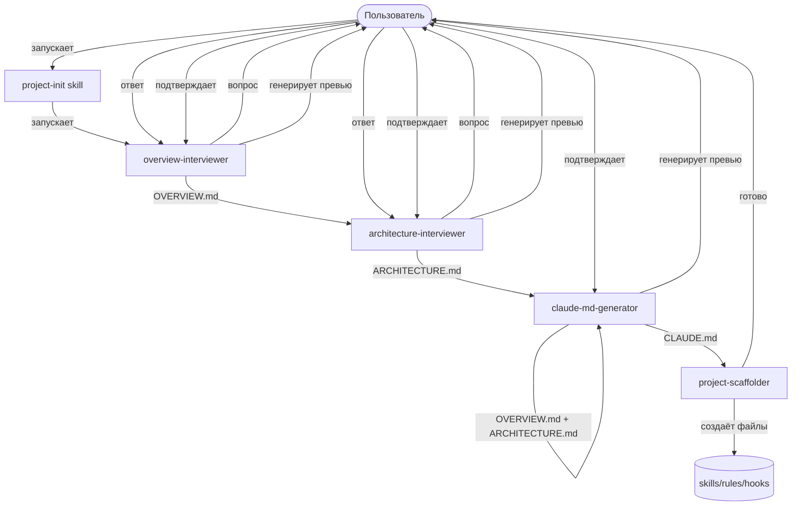

# ARCHITECTURE.md — dm-cc-assistant

## 1. Stack

- Платформа: Claude Code Desktop / CLI
- Формат агентов: Markdown + YAML frontmatter (`.claude/agents/*.md`)
- Формат skills: Markdown + YAML frontmatter (`.claude/skills/*/SKILL.md`)
- Формат hooks: JSON (`.claude/hooks/hooks.json`)
- Язык скриптов в hooks: Bash
- Диаграммы: Mermaid (flowchart, classDiagram)
- Дистрибуция: плагин (`.claude-plugin/plugin.json`)
- Тестирование: `claude --plugin-dir ./dm-cc-assistant`

---

## 2. Module Map

```
dm-cc-assistant/
├── .claude-plugin/
│   └── plugin.json          # манифест плагина
├── agents/
│   ├── overview-interviewer.md      # интервью для OVERVIEW.md
│   ├── architecture-interviewer.md  # интервью для ARCHITECTURE.md
│   ├── claude-md-generator.md       # генерация CLAUDE.md
│   └── project-scaffolder.md        # скаффолдинг skills/rules/hooks
├── skills/
│   └── project-init/
│       └── SKILL.md         # оркестратор — запускает агентов по порядку
├── hooks/
│   └── hooks.json           # базовые hooks (уведомления, форматирование)
├── OVERVIEW.md
├── ARCHITECTURE.md
└── CLAUDE.md
```

---

## 3. Data Flow



---

## 4. API Structure

Внешнего API нет.

---

## 5. Data Model

Агенты общаются через файлы — каждый агент читает результат предыдущего из файловой системы:

- `overview-interviewer` → пишет `OVERVIEW.md`
- `architecture-interviewer` → читает `OVERVIEW.md`, пишет `ARCHITECTURE.md`
- `claude-md-generator` → читает `OVERVIEW.md` + `ARCHITECTURE.md`, пишет `CLAUDE.md`
  - Всегда включает четыре принципа Карпатого: Think Before Coding, Simplicity First, Surgical Changes, Goal-Driven Execution
- `project-scaffolder` → читает все три документа, создаёт структуру skills/rules/hooks

Промежуточного хранилища нет — файлы проекта и есть единственный источник правды.

---

## 6. Configuration

- Конфигурации для пользователя нет — плагин работает из коробки
- Тип проекта определяется в процессе интервью `architecture-interviewer` — не через отдельный конфиг файл
- Язык документации: русский — хардкод в v1
- Расположение создаваемых файлов: текущая директория где запущен Claude Code

---

## 7. Security

Данные хранятся локально в файловой системе проекта. Внешних сервисов и передачи данных нет.

---

## 8. Constraints

- Агенты в плагине не могут использовать `hooks`, `mcpServers`, `permissionMode` в frontmatter — ограничение Claude Code
- Skills из плагина получают namespace: `/dm-cc-assistant:project-init` — нельзя убрать
- Агенты не могут порождать других агентов — subagents не могут спаунить subagents
- Все генерируемые файлы пишутся в текущую директорию — не в произвольное место
- Генерируемый CLAUDE.md всегда содержит четыре принципа Карпатого — это не опционально

---

## 9. Tech Debt

Пока нет. Обновлять после каждой задачи которая оставила временное решение.

---

## 10. Code Hotspots

Пока нет. Обновлять после первого цикла разработки.
