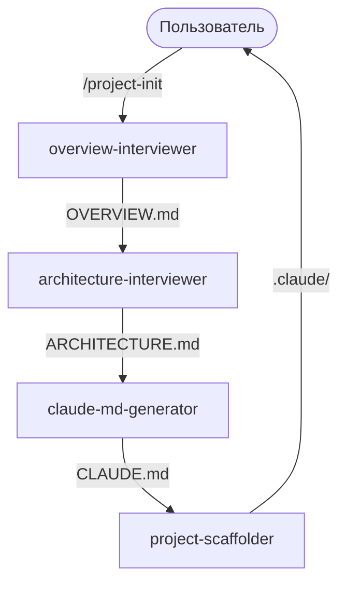
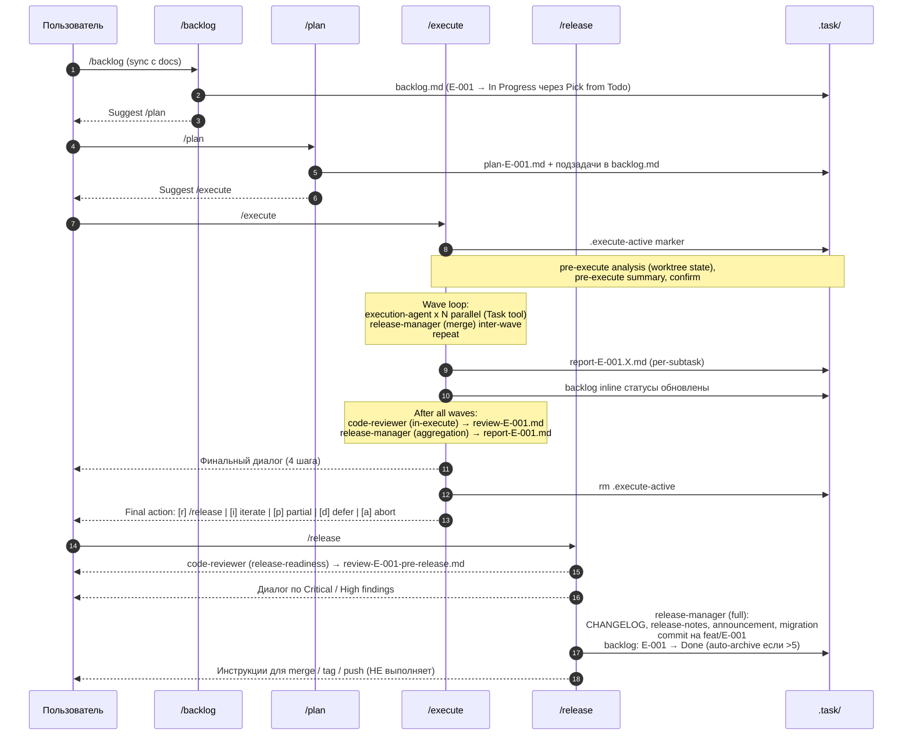

# ARCHITECTURE.md — dm-cc-assistant

## 1. Stack

- Платформа: Claude Code Desktop / CLI (с поддержкой Task tool для subagent orchestration).
- Формат агентов: Markdown + YAML frontmatter (`agents/*.md`).
- Формат skills: Markdown + YAML frontmatter (`skills/*/SKILL.md`).
- Формат hooks: JSON (`hooks/hooks.json`).
- Язык скриптов в hooks: Bash (через `bash -c`).
- Git: worktree'ы для параллельного исполнения подзадач (`/execute`).
- Диаграммы: Mermaid (flowchart, classDiagram).
- Дистрибуция: плагин (`.claude-plugin/plugin.json` + self-hosted marketplace `.claude-plugin/marketplace.json`).
- Тестирование: `claude --plugin-dir ./dm-cc-assistant`.

---

## 2. Module Map

```
dm-cc-assistant/
├── .claude-plugin/
│   ├── plugin.json                  # манифест плагина
│   └── marketplace.json             # self-hosted marketplace (dm-cc)
├── agents/
│   ├── overview-interviewer.md      # project-init: интервью → OVERVIEW.md
│   ├── architecture-interviewer.md  # project-init: интервью → ARCHITECTURE.md (требует [Priority] в §9/§10)
│   ├── claude-md-generator.md       # project-init: генерация CLAUDE.md
│   ├── project-scaffolder.md        # project-init: скаффолд .claude/
│   ├── backlog-planner.md           # /backlog: эпики, sync, suggestions, миграция v0.2→v0.3
│   ├── epic-planner.md              # /plan: 7-фазное планирование одного эпика
│   ├── execution-agent.md           # /execute: автономная работа в worktree (одна подзадача)
│   ├── resume-analyzer.md           # /execute: анализ прерванной подзадачи (resume context)
│   ├── code-reviewer.md             # /execute (in-execute) и /release (release-readiness)
│   ├── docs-updater.md              # внутренний: targeted edits docs с [Priority] поддержкой
│   └── release-manager.md           # /execute (merge / aggregation) + /release (full)
├── skills/
│   ├── project-init/SKILL.md
│   ├── backlog/SKILL.md
│   ├── plan/SKILL.md
│   ├── execute/SKILL.md
│   └── release/SKILL.md
├── hooks/hooks.json                 # SessionStart с двухуровневой моделью + .execute-active marker
├── OVERVIEW.md
├── ARCHITECTURE.md
├── CLAUDE.md
├── README.md
├── CHANGELOG.md
└── LICENSE
```

**Артефакты, создаваемые в проекте пользователя:**

```
user-project/
├── OVERVIEW.md                      # project-init создаёт; docs-updater обновляет
├── ARCHITECTURE.md                  # project-init создаёт; docs-updater обновляет
├── CLAUDE.md                        # project-init создаёт; docs-updater обновляет
├── CHANGELOG.md                     # release-manager (full mode) дополняет
├── .claude/                         # project-init: project-scaffolder (только KMP)
└── .task/                           # рабочая директория агентов
    ├── backlog.md                   # backlog-planner: эпики; epic-planner добавляет подзадачи
    ├── backlog-archive.md           # release-manager (full): auto-archive при Done > 5
    ├── plan-E-XXX.md                # epic-planner: per-epic
    ├── report-E-XXX.Y.md            # execution-agent: per-subtask
    ├── research-E-XXX.Y.md          # execution-agent (research subtask)
    ├── resume-E-XXX.Y.md            # resume-analyzer (по запросу /execute)
    ├── report-E-XXX.md              # release-manager (aggregation): per-epic agregate
    ├── merge-E-XXX-wave-N.md        # release-manager (merge): per-wave merge log (опционально)
    ├── review-E-XXX.md              # code-reviewer (in-execute): findings
    ├── review-E-XXX-pre-release.md  # code-reviewer (release-readiness): findings
    ├── release-notes-vX.Y.Z.md      # release-manager (full)
    ├── announcement-vX.Y.Z.md       # release-manager (full)
    ├── migration-vX.Y.Z.md          # release-manager (full, только при breaking)
    └── .execute-active              # marker файл активного /execute (machine-only)
```

`.worktrees/` — путь по умолчанию для git worktree'ев подзадач (создаются `/execute`, удаляются release-manager merge mode по статусу подзадачи).

---

## 3. Data Flow

### v0.1: Инициализация проекта



### v0.3: Эпический цикл



---

## 4. API Structure

Внешнего API нет. Команды плагина работают через `/dm-cc-assistant:*` namespace.

---

## 5. Data Model

### v0.1: Pipeline (строгая последовательность)

- `overview-interviewer` → пишет `OVERVIEW.md`
- `architecture-interviewer` → читает `OVERVIEW.md`, пишет `ARCHITECTURE.md`
- `claude-md-generator` → читает оба, пишет `CLAUDE.md`
- `project-scaffolder` → читает все три документа, создаёт `.claude/`

### v0.3: Двухуровневая модель backlog'а

**Уровни и ID-схема:**
- Эпик: `E-001`
- Подзадача: `E-001.1` (точечная нотация — родитель виден из ID)

**Статусы:**

| Уровень | Значения | Где |
|---|---|---|
| Эпик | `Todo` / `In Progress` / `Done` / `Cancelled` | Через секцию в `backlog.md` |
| Подзадача | `Todo` / `In Progress` / `Done` / `Failed` / `Skipped` / `Conflict-blocked` / `Cancelled` | Inline в строке подзадачи под активным эпиком |

**Тип эпика (опциональный inline-лейбл):** `Functional` (default), `Tech Debt`, `Research`, `Infrastructure`, `Cleanup`.

**Параллелизм:**
- Внутри эпика — волны подзадач (параллельные worktree'ы).
- Между эпиками — **один эпик In Progress за раз** (линейный pipeline).

### Агенты v0.3 — кто что пишет

| Агент | Создаёт / обновляет | Не трогает |
|---|---|---|
| `backlog-planner` | `.task/backlog.md` (эпики), `backlog.v02.md` (миграция бэкап) | Подзадачи |
| `epic-planner` | `.task/plan-E-XXX.md`, `.task/backlog.md` (подзадачи под активным эпиком) | Статус эпика, OVERVIEW/ARCHITECTURE |
| `execution-agent` | `.task/report-E-XXX.Y.md`, `.task/research-E-XXX.Y.md` (research mode), commits на `feat/E-XXX.Y-<slug>` | backlog.md, plan.md, чужие worktree'ы |
| `resume-analyzer` | `.task/resume-E-XXX.Y.md` | Worktree, коммиты, ветки |
| `release-manager` (merge) | merge'и в `feat/E-XXX`, cleanup worktree'ев Done подзадач, inline-статусы подзадач, `.task/merge-E-XXX-wave-N.md` (опц.) | Plan.md |
| `release-manager` (aggregation) | `.task/report-E-XXX.md` | — |
| `release-manager` (full) | `CHANGELOG.md`, `README.md`, version files, `.task/release-notes-*.md`, `.task/announcement-*.md`, `.task/migration-*.md`, commits на feat/E-XXX, `.task/backlog.md` (E-XXX → Done), `.task/backlog-archive.md` | Push, tag, merge в main |
| `code-reviewer` (in-execute) | `.task/review-E-XXX.md` | Код проекта |
| `code-reviewer` (release-readiness) | `.task/review-E-XXX-pre-release.md` | Код проекта |
| `docs-updater` | `OVERVIEW.md`, `ARCHITECTURE.md`, `CLAUDE.md` (targeted edits, требует `[Priority]` в §9/§10 для Tech Debt / Hotspots) | backlog.md, код, версии |

**Edit log convention** — все генерируемые файлы получают `> **Edit log:**` секцию сразу после H1, latest first, формат:

```
- YYYY-MM-DD · vX.Y.Z · <agent-name> · <краткое описание>
```

Не применяется к: `README.md`, `LICENSE`, `CHANGELOG.md`, `.claude/` scaffold, `.execute-active` marker.

---

## 6. Configuration

- Конфигураций для пользователя нет — плагин работает из коробки.
- Тип проекта определяется в процессе интервью `architecture-interviewer`.
- Язык документации: русский — хардкод в v0.1 / v0.3.
- Расположение создаваемых файлов: текущая директория.
- Auto-archive порог захардкожен: `## Done` > 5 → старшие эпики в `.task/backlog-archive.md`.
- Default путь worktree'ев: `.worktrees/E-XXX.Y` (создаются `/execute`).

---

## 7. Security

Данные хранятся локально в файловой системе проекта. Внешних сервисов и передачи данных нет.

`/release` явно не делает push / tag — release-материалы сначала локальные, пользователь решает что и когда отправлять.

---

## 8. Constraints

- Агенты в плагине не могут использовать `hooks`, `mcpServers`, `permissionMode` в frontmatter — ограничение Claude Code.
- Skills из плагина получают namespace: `/dm-cc-assistant:*` — нельзя убрать.
- **Subagents не могут спаунить других subagents.** Из-за этого orchestrator (`skills/<name>/SKILL.md`, выполняемый main Claude) сам спаунит code-reviewer, release-manager и execution-agent'ов в нужном порядке.
- Все генерируемые файлы пишутся в текущую директорию.
- Один эпик в `## In Progress` за раз — линейный pipeline между эпиками.
- В одной волне подзадачи **не могут** иметь пересекающиеся `Файлы:` — структурная инвариантa, проверяется в `/plan` фаза 3.
- `/release` не делает `git push`, `git tag`, `git merge` в main, `git checkout main` — это руки пользователя.
- `code-reviewer` read-only по отношению к коду проекта — пишет только в `.task/review-E-XXX*.md`.
- `execution-agent` работает только в **своём** worktree, не модифицирует чужие.
- `.task/.execute-active` marker блокирует параллельные `/execute` и предупреждает остальные команды.
- Edit log convention обязателен для всех генерируемых файлов кроме исключений (см. §5).

---

## 9. Tech Debt

- [Medium] Bash-логика в hooks/hooks.json становится крупной — потенциально вынести в отдельный shell-скрипт `hooks/session-start.sh`, который вызывается из JSON одной строкой.

---

## 10. Code Hotspots

- [Medium] `agents/release-manager.md` — три режима в одном файле, ~600 строк. При следующей итерации стоит проверить, не имеет ли смысл разделить (или хотя бы добавить навигацию по якорям).
- [Medium] `skills/execute/SKILL.md` — главный orchestrator, многошаговый. Самая хрупкая часть к рефакторингу.
