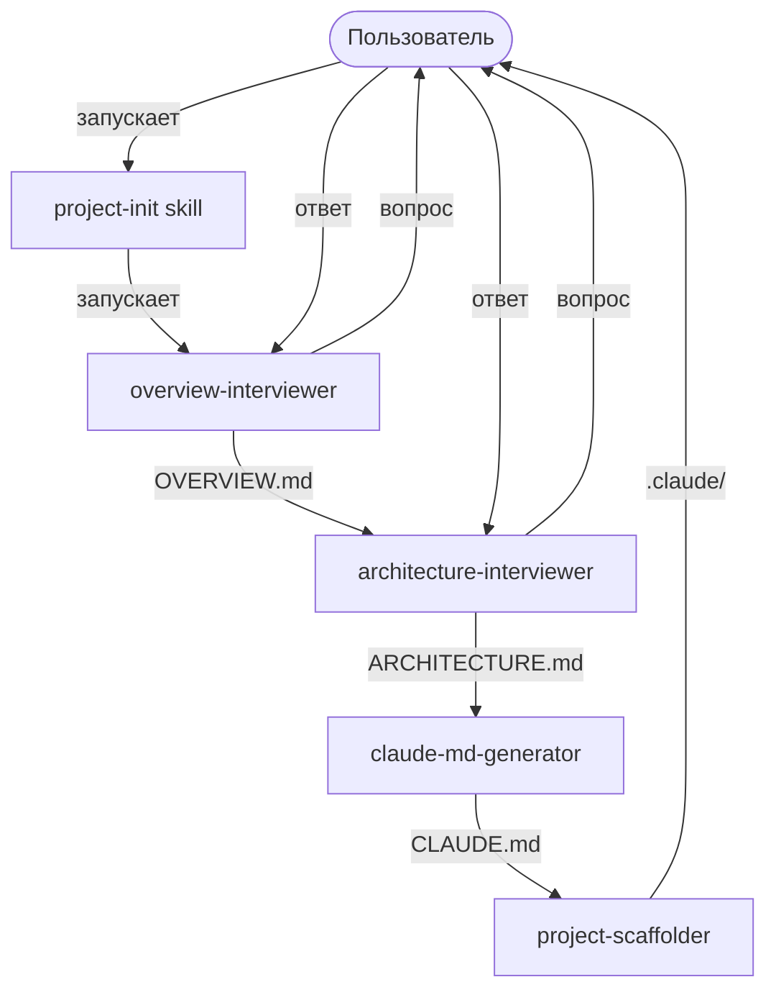
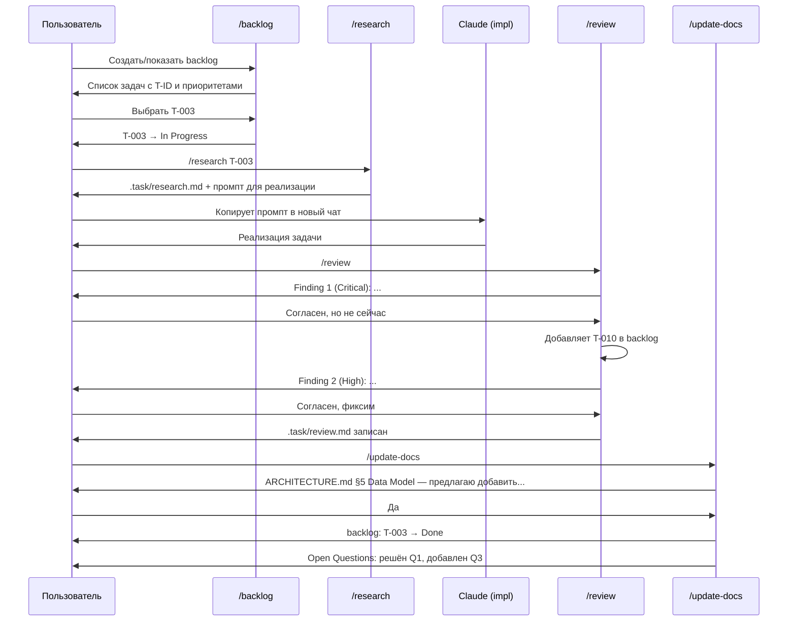

# ARCHITECTURE.md — dm-cc-assistant

## 1. Stack

- Платформа: Claude Code Desktop / CLI
- Формат агентов: Markdown + YAML frontmatter (`.claude/agents/*.md`)
- Формат skills: Markdown + YAML frontmatter (`.claude/skills/*/SKILL.md`)
- Формат hooks: JSON (`.claude/hooks/hooks.json`)
- Язык скриптов в hooks: Bash
- Диаграммы: Mermaid (flowchart, classDiagram)
- Дистрибуция: плагин (`.claude-plugin/plugin.json`)
- Тестирование: `claude --plugin-dir ./dm-cc-assistant`

---

## 2. Module Map

```
dm-cc-assistant/
├── .claude-plugin/
│   ├── plugin.json              # манифест плагина
│   └── marketplace.json         # self-hosted marketplace (dm-cc)
├── agents/
│   ├── overview-interviewer.md  # v1: интервью для OVERVIEW.md
│   ├── architecture-interviewer.md  # v1: интервью для ARCHITECTURE.md
│   ├── claude-md-generator.md   # v1: генерация CLAUDE.md
│   ├── project-scaffolder.md    # v1: скаффолдинг skills/rules/hooks
│   ├── backlog-planner.md       # v2: генерация и управление backlog
│   ├── task-researcher.md       # v2: research задачи из backlog
│   ├── code-reviewer.md         # v2: интерактивный ревью кода
│   └── docs-updater.md          # v2: обновление docs + backlog + open questions
├── skills/
│   ├── project-init/
│   │   └── SKILL.md             # v1: оркестратор инициализации
│   ├── backlog/
│   │   └── SKILL.md             # v2: создание / управление backlog
│   ├── research/
│   │   └── SKILL.md             # v2: research задачи по T-ID
│   ├── review/
│   │   └── SKILL.md             # v2: ревью изменений
│   └── update-docs/
│       └── SKILL.md             # v2: обновление документации
├── hooks/
│   └── hooks.json               # SessionStart приветствие с контекстными подсказками
├── OVERVIEW.md
├── ARCHITECTURE.md
└── CLAUDE.md
```

**Артефакты, создаваемые в проекте пользователя:**

```
user-project/
├── OVERVIEW.md              # v1: project-init, v2: docs-updater обновляет
├── ARCHITECTURE.md          # v1: project-init, v2: docs-updater обновляет
├── CLAUDE.md                # v1: project-init, v2: docs-updater обновляет
├── .claude/                 # v1: project-scaffolder (только KMP)
└── .task/                   # v2: рабочая директория агентов
    ├── backlog.md           # backlog-planner: задачи с T-ID и приоритетами
    ├── research.md          # task-researcher: research текущей задачи
    └── review.md            # code-reviewer: результаты ревью
```

---

## 3. Data Flow

### v1: Инициализация проекта



### v2: Цикл задачи



---

## 4. API Structure

Внешнего API нет.

---

## 5. Data Model

Агенты общаются через файлы — каждый агент читает результат предыдущего из файловой системы.

### v1: Pipeline (строгая последовательность)

- `overview-interviewer` → пишет `OVERVIEW.md`
- `architecture-interviewer` → читает `OVERVIEW.md`, пишет `ARCHITECTURE.md`
- `claude-md-generator` → читает `OVERVIEW.md` + `ARCHITECTURE.md`, пишет `CLAUDE.md`
  - Всегда включает принципы: Think Before Coding, Simplicity First, Surgical Changes, Goal-Driven Execution, One Question at a Time
- `project-scaffolder` → читает все три документа, создаёт структуру `.claude/`

### v2: Независимые агенты (каждый читает из ground truth)

- `backlog-planner` → читает `OVERVIEW.md` + `ARCHITECTURE.md`, пишет `.task/backlog.md`
  - Формат backlog: задачи с T-ID (T-001, T-002, ...), приоритетами (Critical/High/Medium/Low), зависимостями, итерациями
  - ID стабильные — не меняются при смене статуса
- `task-researcher` → читает `.task/backlog.md` + docs + кодовую базу, пишет `.task/research.md`
  - Привязка к задаче по T-ID
  - В конце — готовый промпт для нового чата
- `code-reviewer` → читает `git diff` + `CLAUDE.md` + `ARCHITECTURE.md`, пишет `.task/review.md`
  - Может добавлять задачи в `.task/backlog.md` (с новыми T-ID)
- `docs-updater` → читает `git diff/log` + docs, обновляет docs + `.task/backlog.md` + open questions
  - Targeted edits — не полная перезапись
  - PRINCIPLES section immutable

Агенты v2 не образуют pipeline — каждый читает из ground truth (git, docs, codebase) и не зависит от выхода другого v2-агента. `.task/backlog.md` — единственный shared state между ними.

---

## 6. Configuration

- Конфигурации для пользователя нет — плагин работает из коробки
- Тип проекта определяется в процессе интервью `architecture-interviewer` — не через отдельный конфиг файл
- Язык документации: русский — хардкод в v1
- Расположение создаваемых файлов: текущая директория где запущен Claude Code

---

## 7. Security

Данные хранятся локально в файловой системе проекта. Внешних сервисов и передачи данных нет.

---

## 8. Constraints

- Агенты в плагине не могут использовать `hooks`, `mcpServers`, `permissionMode` в frontmatter — ограничение Claude Code
- Skills из плагина получают namespace: `/dm-cc-assistant:*` — нельзя убрать
- Агенты не могут порождать других агентов — subagents не могут спаунить subagents
- Все генерируемые файлы пишутся в текущую директорию — не в произвольное место
- Генерируемый CLAUDE.md всегда содержит принципы Карпатого + One Question at a Time — это не опционально
- code-reviewer read-only по отношению к коду проекта — может писать только в `.task/`
- docs-updater делает targeted edits — не перезаписывает документы целиком
- `.task/research.md` и `.task/review.md` перезаписываются при каждом запуске — history не хранится

---

## 9. Tech Debt

Пока нет. Обновлять после каждой задачи которая оставила временное решение.

---

## 10. Code Hotspots

Пока нет. Обновлять после первого цикла разработки.
