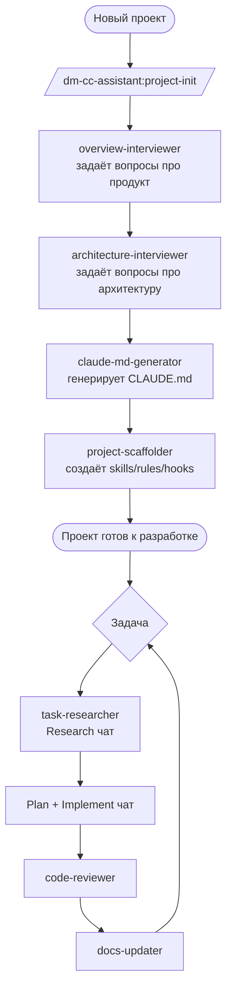

# OVERVIEW.md — dm-cc-assistant

## 1. Обзор и цель

`dm-cc-assistant` — плагин для Claude Code который сопровождает весь цикл разработки: от старта проекта (документация, скаффолдинг) до ежедневной работы (цикл задач, ревью, обновление документации).

---

## 2. Описание проблемы

Работа с Claude в реальных проектах сопряжена с несколькими проблемами:
- Каждый проект начинается заново — нет единого процесса создания документации и настройки окружения
- Поддерживать в актуальном состоянии CLAUDE.md, OVERVIEW.md, ARCHITECTURE.md, skills, rules и hooks — большая ручная работа которая растёт с каждым проектом
- Лучшие практики работы с Claude — свои и из комьюнити — не переносятся между проектами автоматически
- Claude не имеет нужного контекста и делает предсказуемые ошибки которых можно было избежать при правильной настройке

---

## 3. Целевые пользователи

**Основная персона: разработчик**
- Ведёт несколько проектов одновременно: Python либы, KMP приложения, Data Research
- Активно использует Claude Code в ежедневной работе
- Знает best practices работы с Claude, но тратит много времени на ручную настройку каждого проекта
- Хочет сосредоточиться на коде, а не на поддержке Claude окружения

---

## 4. Клиентский путь

Верхняя часть до "Проект готов к разработке" — scope v1.

---

## 5. Цели и метрики успеха

- Старт нового проекта занимает ≤ 30 минут вместо нескольких часов
- OVERVIEW.md, ARCHITECTURE.md, CLAUDE.md созданы и заполнены после одного запуска `/project-init`
- Скелет skills/rules/hooks создан и соответствует типу проекта
- Провал: если пользователь после запуска вынужден существенно переписывать сгенерированные документы

---

## 6. Скоуп и ключевые фичи

**Must (v1):**
- Интервью и генерация OVERVIEW.md
- Интервью и генерация ARCHITECTURE.md
- Генерация CLAUDE.md из первых двух
- Скаффолдинг skills/rules/hooks для KMP проектов
- Оркестратор `/project-init` который запускает всё по порядку

**Should:**
- Поддержка существующих проектов (анализ кодовой базы вместо интервью)

**Could:**
- Цикл задачи (Research/Plan/Implement агенты)
- Агент ревью кода
- Агент обновления документации
- Скаффолдинг для других типов проектов через дополнительные skills

**Won't (v1):**
- Интеграция с внешними сервисами (Jira, GitHub, Notion)
- Мультиязычная документация

---

## 7. Non-goals

- Не заменяем ручное написание документации — только помогаем структурировать через интервью
- Не поддерживаем существующие проекты в v1 — только новые с нуля
- Не интегрируемся с внешними сервисами
- Не генерируем код проекта — только Claude окружение (документация, skills, rules, hooks)
- Не гарантируем что сгенерированные документы не потребуют правок — это отправная точка, не финальный результат

---

## 8. Допущения и ограничения

- Пользователь может не знать компоненты Claude Code — агент объясняет зачем нужен каждый документ в процессе интервью
- Пользователь готов отвечать на вопросы интервью развёрнуто — качество документов зависит от качества ответов
- Плагин работает только с Claude Code — не с другими AI инструментами
- v1 поддерживает скаффолдинг только для KMP проектов — другие типы добавляются через дополнительные skills
- Документы генерируются на русском языке
- Агент показывает превью каждого документа и спрашивает подтверждение перед сохранением
- Если ответ на вопрос интервью неполный или размытый — агент переспрашивает

---

## 9. Открытые вопросы

- Какой минимальный набор skills/rules/hooks достаточен для KMP проекта?
