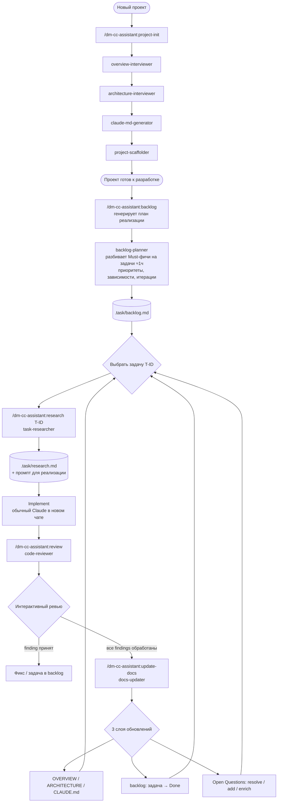

# OVERVIEW.md — dm-cc-assistant

## 1. Обзор и цель

`dm-cc-assistant` — плагин для Claude Code который сопровождает весь цикл разработки: от старта проекта (документация, скаффолдинг) до ежедневной работы (цикл задач, ревью, обновление документации).

---

## 2. Описание проблемы

Работа с Claude в реальных проектах сопряжена с несколькими проблемами:
- Каждый проект начинается заново — нет единого процесса создания документации и настройки окружения
- Поддерживать в актуальном состоянии CLAUDE.md, OVERVIEW.md, ARCHITECTURE.md, skills, rules и hooks — большая ручная работа которая растёт с каждым проектом
- Лучшие практики работы с Claude — свои и из комьюнити — не переносятся между проектами автоматически
- Claude не имеет нужного контекста и делает предсказуемые ошибки которых можно было избежать при правильной настройке

---

## 3. Целевые пользователи

**Основная персона: разработчик**
- Ведёт несколько проектов одновременно: Python либы, KMP приложения, Data Research
- Активно использует Claude Code в ежедневной работе
- Знает best practices работы с Claude, но тратит много времени на ручную настройку каждого проекта
- Хочет сосредоточиться на коде, а не на поддержке Claude окружения

---

## 4. Клиентский путь

Верхняя часть до «Проект готов к разработке» — scope v1. Нижняя часть (backlog → task cycle) — scope v2.

---

## 5. Цели и метрики успеха

**v1 (project-init):**
- Старт нового проекта занимает ≤ 30 минут вместо нескольких часов
- OVERVIEW.md, ARCHITECTURE.md, CLAUDE.md созданы и заполнены после одного запуска `/project-init`
- Скелет skills/rules/hooks создан и соответствует типу проекта
- Провал: если пользователь после запуска вынужден существенно переписывать сгенерированные документы

**v2 (backlog + task cycle):**
- Backlog генерируется из OVERVIEW + ARCHITECTURE за одну сессию `/backlog`
- Задачи мелкие (≈ 1 час) и с явными приоритетами — пользователь может сразу начать работу
- Research выдаёт готовый промпт для нового чата — переход к реализации без ручной формулировки
- Code review интерактивен — findings обсуждаются по одному, а не свалены в отчёт
- Docs остаются актуальными после каждой задачи — update-docs обновляет docs + backlog + open questions
- Провал: если пользователь перестаёт пользоваться циклом потому что он медленнее, чем делать руками

---

## 6. Скоуп и ключевые фичи

**Must (v1 — done ✅):**
- Интервью и генерация OVERVIEW.md
- Интервью и генерация ARCHITECTURE.md
- Генерация CLAUDE.md из первых двух
- Скаффолдинг skills/rules/hooks для KMP проектов
- Оркестратор `/project-init` который запускает всё по порядку

**Must (v2 — in progress):**
- Генерация backlog из OVERVIEW + ARCHITECTURE (`/backlog`) с приоритетами и T-ID
- Research задачи из backlog (`/research T-ID`) с генерацией промпта для реализации
- Интерактивный code review (`/review`) с приоритизацией findings и добавлением задач в backlog
- Обновление документации (`/update-docs`) — 3 слоя: docs + backlog + open questions
- Связка открытых вопросов между сессиями (сессионные → docs / backlog / глобальные)

**Should:**
- Поддержка существующих проектов (анализ кодовой базы вместо интервью)

**Could:**
- Скаффолдинг для других типов проектов через дополнительные skills

**Won't:**
- Интеграция с внешними сервисами (Jira, GitHub, Notion) — не сейчас, но возможно в будущем
- Мультиязычная документация — не сейчас, но возможно в будущем

---

## 7. Non-goals

- Не заменяем ручное написание документации — помогаем структурировать через интервью и поддерживать в актуальном состоянии
- Не интегрируемся с внешними сервисами (Jira, GitHub Issues, Notion) — backlog живёт в `.task/backlog.md`, не во внешней системе
- Не генерируем код проекта — только Claude окружение (документация, skills, rules, hooks, backlog)
- Не гарантируем что сгенерированные документы не потребуют правок — это отправная точка, не финальный результат
- Не автоматизируем CI/CD — review и update-docs запускаются вручную, не по триггерам

---

## 8. Допущения и ограничения

- Пользователь может не знать компоненты Claude Code — агент объясняет зачем нужен каждый документ в процессе интервью
- Пользователь готов отвечать на вопросы развёрнуто — качество документов и backlog'а зависит от качества ответов
- Плагин работает только с Claude Code — не с другими AI инструментами
- v1 поддерживает скаффолдинг только для KMP проектов — другие типы добавляются через дополнительные skills
- Документы и backlog генерируются на русском языке
- Все агенты интерактивны: показывают превью, обсуждают по одному вопросу, ждут подтверждение
- Если ответ неполный или размытый — агент переспрашивает точечно
- Задачи в backlog мелкие (≈ 1 час) — Claude склонен переоценивать размер, поэтому агент дробит на мелкие
- Research и review работают поверх git — без git repo review недоступен, research работает в degraded mode
- `.task/` — рабочая директория агентов, не коммитится (рекомендация добавить в `.gitignore`)

---

## 9. Открытые вопросы

- Какой минимальный набор skills/rules/hooks достаточен для KMP проекта? (v1, пока не закрыт)
- Нужна ли history `.task/research.md` и `.task/review.md` (сейчас перезаписываются) или достаточно последнего?
- Как docs-updater определяет границы «сессионных» открытых вопросов vs глобальных — нужен ли явный маркер в backlog?
