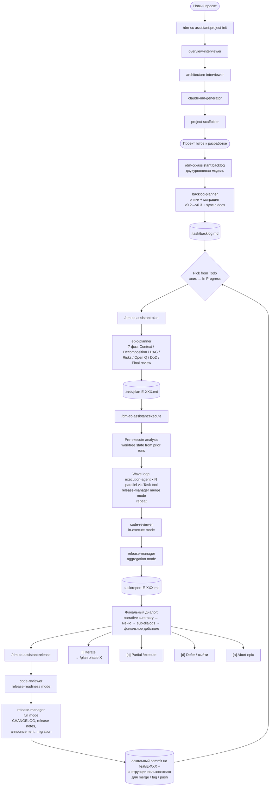

# OVERVIEW.md — dm-cc-assistant

## 1. Обзор и цель

`dm-cc-assistant` — плагин для Claude Code, который сопровождает весь цикл разработки: от старта проекта (документация, скаффолдинг) до автономного исполнения эпиков (планирование, параллельный прогон в worktree'ах, подготовка релиза).

---

## 2. Описание проблемы

Работа с Claude в реальных проектах сопряжена с несколькими проблемами:
- Каждый проект начинается заново — нет единого процесса создания документации и настройки окружения.
- Поддерживать в актуальном состоянии CLAUDE.md, OVERVIEW.md, ARCHITECTURE.md, skills, rules и hooks — большая ручная работа, которая растёт с каждым проектом.
- Лучшие практики работы с Claude — свои и из комьюнити — не переносятся между проектами автоматически.
- Claude не имеет нужного контекста и делает предсказуемые ошибки, которых можно было избежать при правильной настройке.
- Декомпозиция эпика на подзадачи и параллельное исполнение — много ручного оркестрирования (worktree'ы, merge'и между волнами, агрегация отчётов, готовность к релизу).

---

## 3. Целевые пользователи

**Основная персона: разработчик**
- Ведёт несколько проектов одновременно: Python либы, KMP приложения, Data Research.
- Активно использует Claude Code в ежедневной работе.
- Знает best practices работы с Claude, но тратит много времени на ручную настройку каждого проекта.
- Хочет сосредоточиться на коде, а не на поддержке Claude окружения и ручном оркестрировании волн.

---

## 4. Клиентский путь

Верхняя часть до «Проект готов к разработке» — scope v0.1. `/backlog` появился в v0.2 и переосмыслен в v0.3. `/plan`, `/execute`, `/release` — scope v0.3.

---

## 5. Цели и метрики успеха

**v0.1 (project-init):**
- Старт нового проекта занимает ≤ 30 минут вместо нескольких часов.
- OVERVIEW.md, ARCHITECTURE.md, CLAUDE.md созданы и заполнены после одного запуска `/project-init`.
- Скелет skills/rules/hooks создан и соответствует типу проекта.

**v0.3 (epic-based lifecycle):**
- Эпик планируется за одну сессию `/plan` — на выходе actionable plan с подзадачами, DAG, волнами, рисками, DoD.
- Подзадачи исполняются автономно параллельно — пользователь даёт один pre-execute confirm и возвращается к финальному отчёту.
- Конфликты между ветками подзадач резолвятся в 3 уровня (combine → auto-pick → user dialog) — **только high-stakes** требуют пользователя.
- Финальный диалог `/execute` структурирован — sub-dialogs по категориям (obstacles / conflicts / review / open questions / decisions / follow-ups), не свалка.
- `/release` не релизит сам — готовит материалы локально, печатает инструкции (push / tag / merge — руки пользователя).

**Провал v0.3:** если пользователь часто прерывает `/execute` руками и делает больше ручной работы, чем в v0.2 цикле.

---

## 6. Скоуп и ключевые фичи

**Must (v0.1 — done ✅):**
- Интервью и генерация OVERVIEW.md / ARCHITECTURE.md / CLAUDE.md
- Скаффолдинг skills/rules/hooks для KMP-проектов
- Оркестратор `/project-init`

**Must (v0.3 — in progress):**
- Двухуровневая модель backlog'а (эпики + подзадачи) и миграция v0.2→v0.3
- 7-фазное планирование активного эпика через `/plan`
- Автономный параллельный прогон через `/execute` (worktree'ы, волны, merge между волнами, агрегированный отчёт)
- 3-уровневая резолюция конфликтов (combine / auto-pick / user dialog)
- Подготовка релиз-материалов через `/release` (CHANGELOG, release notes, announcement, migration)
- Edit log convention для всех генерируемых файлов
- `[Priority]` теги в ARCHITECTURE.md §9/§10

**Should:**
- Поддержка существующих проектов (анализ кодовой базы вместо интервью) — T-004 в backlog'е v0.2/v0.3.

**Could:**
- Скаффолдинг для других типов проектов через дополнительные skills.
- История планов / отчётов (сейчас текущий перезаписывается).

**Won't:**
- Интеграция с внешними сервисами (Jira, GitHub, Notion) — не сейчас.
- Мультиязычная документация — не сейчас.
- Автоматический push / tag / merge из `/release` — принципиально ручное.

---

## 7. Non-goals

- Не заменяем ручное написание документации — помогаем структурировать через интервью и поддерживать в актуальном состоянии.
- Не интегрируемся с внешними сервисами (Jira, GitHub Issues, Notion) — backlog живёт в `.task/backlog.md`, не во внешней системе.
- Не генерируем код проекта — только Claude окружение (документация, skills, rules, hooks, backlog, plan, отчёты).
- Не гарантируем что сгенерированные документы / планы / отчёты не потребуют правок — это отправная точка, не финал.
- Не автоматизируем CI/CD и доставку релиза — `/release` готовит материалы локально, push/tag/merge — пользователь.
- Не пытаемся перепланировать активный эпик из execution-agent'а — изменения скоупа во время прогона запрещены.

---

## 8. Допущения и ограничения

- Пользователь может не знать компоненты Claude Code — агент объясняет зачем нужен каждый документ в процессе интервью.
- Пользователь готов отвечать на вопросы развёрнуто — качество документов, плана, эпиков зависит от качества ответов.
- Плагин работает только с Claude Code — не с другими AI-инструментами.
- v0.1 поддерживает скаффолдинг только для KMP проектов — другие типы добавляются через дополнительные skills.
- Документы, backlog, план, отчёты генерируются на русском языке.
- Все интерактивные команды (`/backlog`, `/plan`, `/release`) показывают превью, обсуждают по одному вопросу, ждут подтверждение.
- `/execute` — автономен между pre-execute confirm и финальным диалогом. Никакого диалога между волнами.
- Размер подзадачи — структурный (атомарность, merge-independence), не временной.
- Один эпик в `## In Progress` за раз — линейный pipeline между эпиками.
- `/release` и `/execute` работают поверх git (worktree'ы) — без git repo не запустятся.
- `.task/` — рабочая директория агентов (рекомендация: коммитить `.task/backlog.md`, остальное — gitignore).
- Конфликты в одной волне предотвращаются на этапе `/plan` (структурная инвариантa: пересечение `Файлы:` подзадач в одной волне → reorder).

---

## 9. Открытые вопросы

- Какой минимальный набор skills/rules/hooks достаточен для KMP проекта? (v0.1, пока не закрыт)
- Нужна ли история `.task/plan-E-*.md`, `.task/report-E-*.md`, `.task/research-E-*.X.md` или достаточно текущего? (v0.3)
- Auto-archive при `## Done` > 5 захардкожен — нужен ли конфигурируемый порог? (v0.3)
- Как корректно дать execution-agent'у больше / меньше контекстa из spec'а — есть ли сценарии, когда «декларируемый контекст» в plan'е недостаточен? (v0.3)
- Resume-analyzer всегда сохраняет worktree — стоит ли иметь auto-cleanup после N дней stale? (v0.3)
