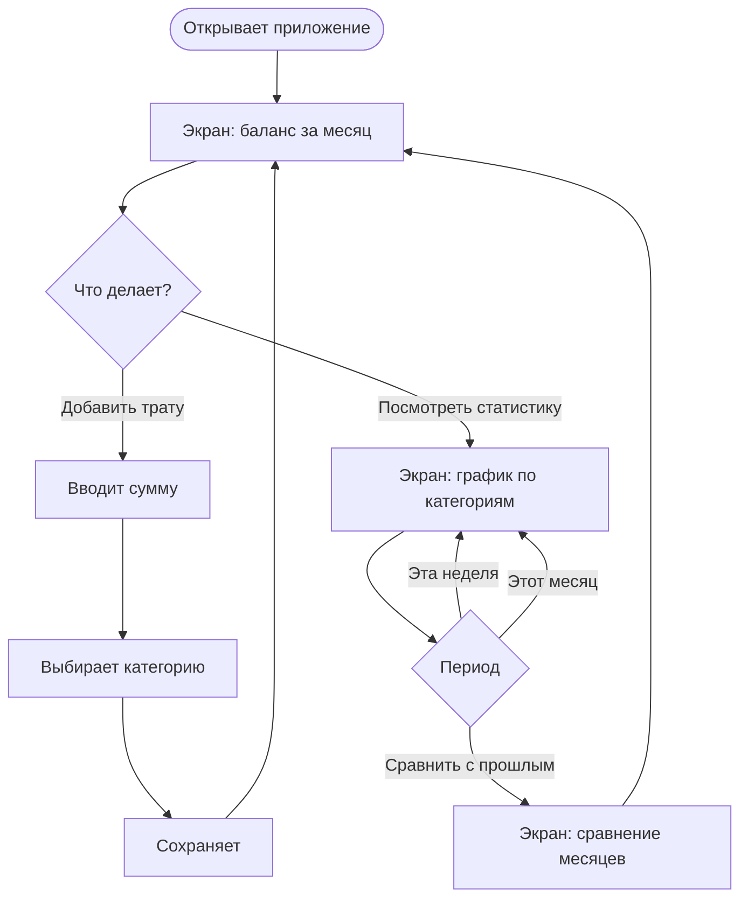
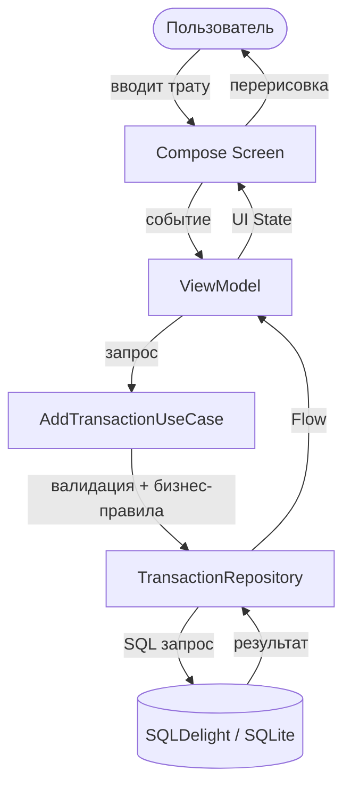

# Claude Workflow Guide

> Личный гайд по работе с Claude для Python-либ, KMP, игр и data research.
> Источники перечислены в конце документа.

---

## CLAUDE.md — паттерны написания

> Самый высоколевереджный файл в проекте. Идёт в каждую Code-сессию. Плохая строка влияет на весь цикл. → [[2]](#источник-2), [[3]](#источник-3)

### Структура (WHY / WHAT / HOW)

- **WHY** — цель проекта, зачем существует
- **WHAT** — структура папок, что за что отвечает
- **HOW** — как запускать тесты, как верифицировать изменения

### Правила

- **Лимит ~60-200 строк** — чем короче, тем лучше. Claude игнорирует инструкции равномерно по мере роста файла — не только новые, но и старые
- **Только универсально применимые инструкции** — инструкция универсальна если она нужна при любой задаче в проекте. Если нужна только в определённом контексте — она не в CLAUDE.md. → [Приложение 1](#приложение-1)
- **Паттерны именования** — писать только для новых проектов без кода. В существующей кодовой базе Claude подхватит стиль сам при чтении файлов
- **Предпочитать указатели на файлы, а не копипаст кода** — код устаревает, ссылки остаются актуальными
- **Не автогенерировать** через `/init` — писать вручную вдумчиво
- **Обновлять** после задач, которые меняют архитектуру

---

### Универсальные принципы поведения Claude (Карпатый)

> Четыре принципа которые стоит включать в CLAUDE.md любого проекта. Напрямую устраняют типичные проблемы с LLM кодингом. → [[23]](#источник-23)

**1. Think Before Coding — думай перед тем как кодить:**
- Явно формулируй допущения — если неуверен, спрашивай а не угадывай
- При неоднозначности — предлагай несколько интерпретаций, не выбирай молча
- Останавливайся когда запутался — называй что непонятно и спрашивай

**2. Simplicity First — минимальный код решающий задачу:**
- Никаких фич сверх запрошенного
- Никаких абстракций для одноразового кода
- Никакой "гибкости" которую не просили
- Если 200 строк можно написать в 50 — перепиши

**3. Surgical Changes — трогай только то что просят:**
- Не "улучшай" соседний код, комментарии, форматирование
- Не рефакторь то что не сломано
- Если твои изменения создали мёртвый код — удаляй его; если мёртвый код был до тебя — только упомяни, не удаляй

**4. Goal-Driven Execution — давай критерии успеха, не инструкции:**
- Трансформируй задачи в верифицируемые цели: "напиши тест который воспроизводит баг, потом сделай чтобы он проходил"
- Для многошаговых задач — явный план с критерием проверки каждого шага
- Claude отлично зацикливается пока не выполнит конкретную цель — используй это

-e 
---

## OVERVIEW.md — руководство по написанию

> Продуктовый документ. Отвечает на вопросы **что** и **почему**. Живой документ — обновляется по мере принятия решений. Фокус на краткости: 2-3 страницы с чёткими ответами лучше 20 страниц требований. → [Приложение 2](#приложение-2), [[4]](#источник-4), [[5]](#источник-5), [[6]](#источник-6)

---

### 1. Обзор и цель

**Зачем:** Одно предложение которое описывает суть продукта. Это north star — к нему возвращаются когда теряется фокус. Claude использует это как главный ориентир при любой задаче.

**Вопросы:**
- Что делает продукт в одном предложении?
- Для кого он существует?
- Какую одну главную проблему решает?
- Почему это важно именно сейчас?

---

### 2. Описание проблемы

**Зачем:** Без понимания проблемы Claude будет оптимизировать не то. Эта секция объясняет контекст — почему продукт вообще нужен.

**Вопросы:**
- Кто конкретно страдает от этой проблемы?
- Как выглядит текущая ситуация (before)?
- Как должна выглядеть идеальная ситуация (after)?
- Почему существующие решения не работают?
- Насколько эта проблема болезненна — люди платят за решение или просто мирятся?

---

### 3. Целевые пользователи

**Зачем:** Определяет для кого принимаются решения. Без этого Claude будет делать "для всех" — что означает "ни для кого".

**Вопросы:**
- Кто основной пользователь (1-2 персоны максимум)?
- Какова его роль, контекст, уровень технической грамотности?
- Какие его топ-3 боли связанные с этой проблемой?
- Когда и где он будет использовать продукт?
- Что для него означает успех?

---

### 4. Клиентский путь

**Зачем:** Описывает как пользователь взаимодействует с продуктом от первого касания до достижения цели. Помогает Claude понять последовательность действий и приоритеты.

**Вопросы:**
- С чего начинается взаимодействие пользователя с продуктом?
- Какие основные шаги он проходит?
- Где возникают сложности или точки выбора?
- Чем заканчивается успешный сценарий?
- Есть ли повторяющийся цикл использования?

**Формат:** Mermaid-диаграмма (`flowchart` или `journey`) + текстовые пояснения к ключевым точкам.

---

### 5. Цели и метрики успеха

**Зачем:** Без измеримых критериев невозможно понять сделана ли задача хорошо. Claude использует это для верификации своей работы.

**Вопросы:**
- Как выглядит успех через 1 месяц после запуска?
- Что можно измерить чтобы понять что продукт работает?
- Какой минимальный результат считается приемлемым?
- Что является явным провалом?

---

### 6. Скоуп и ключевые фичи

**Зачем:** Определяет что войдёт в продукт и в каком приоритете. Структура MoSCoW помогает Claude не делать лишнего и не пропускать важное.

**Вопросы:**
- Какие фичи **обязательны** для запуска (Must)?
- Какие фичи **важны но не блокируют** запуск (Should)?
- Какие фичи **желательны** если останется время (Could)?
- Какие фичи явно **не входят** в этот релиз (Won't)?

---

### 7. Non-goals

**Зачем:** Критично для AI — агент не может вывести границы из того что не написано. Если не сказать явно "не делай X", Claude может добавить X потому что "большинство приложений это имеют".

**Вопросы:**
- Что пользователь может ожидать но мы намеренно не делаем?
- Какие смежные проблемы мы не решаем?
- Какие платформы или аудитории мы намеренно игнорируем?
- Что мы отложили на будущее и почему?

---

### 8. Допущения и ограничения

**Зачем:** Фиксирует на чём основываются решения. Если допущение окажется неверным — это сигнал пересмотреть решения.

**Вопросы:**
- Что мы считаем правдой но не проверили?
- Какие технические ограничения нельзя обойти?
- Какие внешние зависимости есть (платформа, API, библиотеки)?
- Что является hard constraint — то что нельзя менять?

---

### 9. Открытые вопросы

**Зачем:** Фиксирует неопределённость. Лучше явно написать "мы не знаем X" чем притвориться что знаем и получить плохое решение от Claude.

**Вопросы:**
- Что ещё не решено и блокирует проектирование?
- Какие гипотезы нужно проверить перед реализацией?
- Какие решения зависят от внешних факторов?

-e 
---


## ARCHITECTURE.md — руководство по написанию

> Технический документ. Описывает **с чем ты работаешь** — модули, потоки данных, архитектурные решения. Дополняет CLAUDE.md (который говорит как работать) и OVERVIEW.md (который говорит зачем). → [Приложение 3](#приложение-3), [[7]](#источник-7)

---

### 1. Stack

**Зачем:** Claude тратит токены на угадывание стека каждую сессию. Явное описание убирает догадки и предотвращает предложения несовместимых библиотек.

**Вопросы:**
- Какой язык и версия?
- Какие ключевые библиотеки и их версии?
- Какой пакетный менеджер?
- Какая инфраструктура (БД, хостинг, CI/CD)?
- Какие инструменты разработки (линтер, форматтер, тест-фреймворк)?
- Есть ли внешние API или сервисы?

---

### 2. Module Map

**Зачем:** Показывает Claude где что лежит и почему так устроено. Без этого Claude сканирует файловую систему сам — тратит токены и делает неверные выводы о структуре.

**Отличие от CLAUDE.md:** В CLAUDE.md — минимальный указатель ("бизнес-логика в `domain/`"). Здесь — полная карта с объяснением: что за что отвечает, почему так разбито, где легаси, где неочевидные зависимости. CLAUDE.md говорит "где искать", ARCHITECTURE.md объясняет "почему так устроено".

**Вопросы:**
- Какова полная структура папок с кратким описанием каждой?
- За что отвечает каждый модуль и какова его зона ответственности?
- Где живёт бизнес-логика и почему именно там?
- Где конфигурация и как она загружается?
- Где тесты — unit, integration, e2e?
- Какие зависимости между модулями — кто от кого зависит?
- Есть ли устаревший или неиспользуемый код — где он и почему не удалён?
- Есть ли неочевидные решения в структуре — почему именно так?

---

### 3. Class Hierarchy

**Зачем:** Описывает ключевые иерархии классов и интерфейсов. Особенно важно для библиотек — это публичный контракт который Claude не должен нарушать. Без этого Claude может предложить несовместимую иерархию или сломать существующую.

**Когда писать в ARCHITECTURE.md:**
- Библиотека с публичным API — иерархия IS контракт
- Иерархия является ключевым архитектурным решением (например базовый класс от которого наследуется всё)
- Есть ограничения на наследование которые Claude должен соблюдать

**Когда НЕ писать сюда:**
- Простое приложение без сложной иерархии — Claude подхватит из кода
- Иерархия очевидна из структуры папок и именования
- Детальная иерархия конкретного модуля — лучше в `agent_docs/` и ссылка оттуда

**Вопросы:**
- Какие базовые классы или интерфейсы являются ключевыми?
- Что наследуется от чего и почему?
- Какие классы являются публичными (часть API), а какие внутренними?
- Есть ли абстрактные классы — что они определяют?
- Какие методы обязательны к переопределению?
- Есть ли ограничения на наследование (sealed, final)?

**Формат:** текстовое описание + Mermaid-диаграмма классов.

---

### 4. Data Flow

**Зачем:** Описывает как данные движутся через систему. Критично для понимания где что менять и что сломается если изменить компонент.

**Вопросы:**
- Откуда приходят данные (пользователь, API, БД, файл)?
- Как данные трансформируются по пути?
- Куда данные в итоге попадают?
- Есть ли асинхронные потоки или очереди?
- Где происходит валидация данных?

**Формат:** Mermaid-диаграмма (`flowchart` или `sequenceDiagram`) + текстовые пояснения к неочевидным шагам.

---

### 5. API Structure

**Зачем:** Если есть API — Claude должен знать его контракт чтобы не изобретать эндпоинты или не нарушать существующие.

**Вопросы:**
- Какой тип API (REST, GraphQL, gRPC, внутренний)?
- Каковы основные эндпоинты / методы?
- Какой формат запросов и ответов?
- Как устроена аутентификация?
- Есть ли версионирование API?

*Если API нет — секцию пропустить.*

---

### 6. Data Model

**Зачем:** Без понимания модели данных Claude может предложить несовместимые изменения схемы или создать дублирующие структуры.

**Вопросы:**
- Какие основные сущности в системе?
- Какие отношения между ними?
- Где хранятся данные (локально, БД, файл, in-memory)?
- Есть ли миграции — как они устроены?
- Какие поля являются обязательными / уникальными?

---

### 7. Configuration

**Зачем:** Фиксирует как конфигурируется приложение. Claude должен знать откуда брать настройки и что менять нельзя.

**Вопросы:**
- Где хранится конфигурация (env vars, файлы, константы)?
- Какие настройки различаются между окружениями (dev/prod)?
- Есть ли секреты — как они передаются?
- Что является обязательным для запуска?

---

### 8. Security

**Зачем:** Указывает Claude на чувствительные места которые нельзя случайно сломать или обойти.

**Вопросы:**
- Есть ли аутентификация — как устроена?
- Есть ли авторизация — на каком уровне?
- Какие данные являются чувствительными?
- Где граница доверия в системе?

*Если проект без пользователей — описать минимально или пропустить.*

---

### 9. Constraints

**Зачем:** Hard constraints — это то что нельзя менять ни при каких условиях. Claude должен знать их явно.

**Вопросы:**
- Какие технические ограничения нельзя обойти (платформа, версия, лицензия)?
- Что нельзя менять в публичном интерфейсе (breaking changes)?
- Есть ли ограничения по производительности?
- Есть ли требования по совместимости?

---

### 10. Tech Debt

**Зачем:** Предупреждает Claude о проблемных местах. Без этого Claude может улучшить "плохой" код не зная что он намеренно оставлен или помечен к переработке.

**Вопросы:**
- Какие части кода известно что плохие?
- Что запланировано к рефакторингу?
- Какие временные решения были приняты и почему?
- Что нельзя трогать пока не будет решён технический долг?

---

### 11. Code Hotspots

**Зачем:** Указывает на файлы которые меняются чаще всего. Claude будет работать с ними особенно аккуратно.

**Вопросы:**
- Какие файлы или модули меняются при большинстве задач?
- Где сосредоточена основная бизнес-логика?
- Какие файлы наиболее хрупкие — ошибка там ломает многое?

---

-e 
---

## Уровень 1 — Цикл задачи (RPI)

> Каждая задача проходит через цикл: **Research → Plan → Implement**. Два Code чата. → [[1]](#источник-1)

---

### Чат 1 — Research

**Режим:** Code
**Контекст:** новый чат

**Цель:** изучить задачу в контексте проекта и сформулировать чёткий промпт для планирования и реализации.

---

**Структура промпта для Research:**

```
## Задача
<описание задачи из проектной документации>

## Границы (Always / Ask first / Never)
✅ Always: <что можно делать без вопросов>
⚠️ Ask first: <что требует согласования — изменения схемы БД, новые зависимости>
🚫 Never: <что нельзя ни при каких условиях — breaking changes публичного API, etc.>

## Вопросы
<конкретные неопределённости если есть>

## Ожидаемый результат
Прочитай OVERVIEW.md и ARCHITECTURE.md, проанализируй задачу и составь
детальный промпт для следующего чата (Plan + Implement), который включает:
1. Что нужно сделать и почему
2. Какие файлы и модули будут затронуты
3. Технические ограничения и границы
4. Критерий успеха — как проверить что задача выполнена
```

**Преимущество Code режима:** Claude сам читает OVERVIEW.md, ARCHITECTURE.md и кодовую базу — не нужно вручную копировать куски документации в промпт.

**Результат:** готовый промпт для второго чата. Если задача требует уточнения — сначала уточнить, потом повторить Research.

---

### Чат 2 — Plan + Implement

**Режим:** Code
**Контекст:** новый чат, передать промпт из Research

**Цель:** сначала составить план, затем реализовать.

---

**Plan Mode:**
- Начать в Plan Mode — Claude анализирует кодовую базу и составляет план без изменения файлов
- Итерировать пока план не устроит: задавать вопросы, уточнять детали, проверять логику
- Только после одобрения плана — выйти из Plan Mode и начать реализацию

---

**Implement — как формулировать задачу:**
- Задача на уровне цели, не шагов — "реализуй OAuth flow из плана", не "сначала создай класс, потом метод..."
- Указывай конкретные файлы через `@filename` если нужно направить внимание
- Ссылайся на существующие паттерны в кодовой базе: "посмотри как реализован AuthWidget и следуй тому же паттерну"
- Описывай симптом и ожидаемый результат: "тест падает с этой ошибкой [ошибка], напиши фикс и убедись что тест проходит"

**⚠️ Ключевое условие качества — верификация:**
Дать Claude способ проверить свою работу — это самое высоколевереджное действие. Варианты:
- Тесты: "запусти тесты после реализации и исправь падения"
- Пример входа-выхода: "функция должна возвращать X при входе Y"
- Скриншот UI: "сделай скриншот результата и сравни с оригиналом, перечисли отличия"
- Критерий успеха: "билд должен проходить без ошибок"

**Коррекция на ходу:**
- Прерывай Claude как только замечаешь что он идёт не туда — нажми Stop, скорректируй
- Если пришлось поправить дважды по одной проблеме — `/clear` и начать с более конкретного промпта
- Используй subagents для исследования: "используй subagent чтобы изучить как устроена аутентификация" — они работают в отдельном контексте и не засоряют основной чат

**Коммиты:**
Коммитить после каждой рабочей механики. Минимум раз в час. Коммит — точка отката.

**Результат:** рабочий код, прошедший верификацию.

---

### Review

**Как запустить параллельную сессию:**

- **Desktop:** открыть новую сессию в боковой панели — каждая получает изолированный worktree автоматически
- **CLI:** `claude --worktree review` в новом терминале из той же папки проекта

Ключевой принцип: ревью в отдельной сессии с чистым контекстом — Claude не будет предвзят к коду который сам только что написал.

---

**Структура промпта для Code ревью:**

```
## Что ревьюить
<конкретные файлы или @filename, или "изменения относительно main">

## Контекст задачи
<что должен делать этот код, какую задачу решает>

## На что обратить особое внимание
- Корректность логики
- Edge cases которые могут быть не обработаны
- Нарушения архитектурных паттернов проекта (см. ARCHITECTURE.md)
- Потенциальные проблемы с производительностью
- Breaking changes публичного API

## Формат ответа
Для каждой проблемы: файл + строка, описание проблемы, предложение как исправить.
```

**Структура промпта для критического ревью (Chat):**

```
Разгроми это решение. Найди все слабые места — логические ошибки,
неочевидные edge cases, архитектурные проблемы, потенциальные баги.
Не соглашайся пока я не отвечу на каждое возражение.
```

**Результат:** список конкретных проблем с указанием файла и строки. Каждая проблема — отдельное решение: исправить сейчас или занести в Tech Debt.

---

### Итерация

**Критерии приёмки результата:** → [[14]](#источник-14)

Прежде чем решать что делать с результатом — оцени по трём осям:

| Ось | Вопрос |
|-----|--------|
| **Функциональность** | Тесты проходят? Критерий успеха из плана выполнен? |
| **Архитектура** | Решение соответствует паттернам проекта? Нет нарушений constraints из ARCHITECTURE.md? |
| **Локальность** | Проблема в одном месте или одно и то же в нескольких точках? |

---

**Переделать целиком если:**
- Одна и та же проблема появляется в нескольких местах — значит неверное архитектурное допущение, патч не поможет
- Решение нарушает ключевые архитектурные принципы проекта — работает, но системно не так
- Код дублирует существующую логику вместо переиспользования — AI создал специфичное решение там где нужно общее
- Пришлось патчить более двух раз по одной проблеме — контекст загрязнён, проще начать заново

Промпт: *"Зная всё что знаешь сейчас — выкинь это и реализуй элегантно"*

**Патчить точечно если:**
- Локальный баг в одном конкретном месте
- Тесты падают по понятной изолированной причине
- Нарушение именования, стиля или минорное несоответствие

**Принять как Tech Debt если:**
- Код работает корректно, но неоптимально
- Исправление требует больше времени чем ценность задачи прямо сейчас
- Не блокирует другие задачи
- → Занести в секцию Tech Debt в ARCHITECTURE.md

---

**После хорошего результата:**
Решить нужно ли обновить проектную документацию — если задача изменила архитектуру или продуктовые решения:
- Изменилась структура модулей → обновить ARCHITECTURE.md
- Изменился скоуп или non-goals → обновить OVERVIEW.md
- Появился новый паттерн именования или ограничение → обновить CLAUDE.md

---

### Контекст-гигиена внутри цикла

> → [[10]](#источник-10), [[11]](#источник-11), [[12]](#источник-12), [[13]](#источник-13)

**Когда создавать новую сессию:**
- Каждый чат RPI — отдельная сессия. Это не опционально.
- Внутри сессии: при заполнении контекста > 60% (CLI: `/context`, Desktop: индикатор) — не ждать деградации до 90%
- При смене задачи на несвязанную — `/clear` или новый чат

**Почему не полагаться на `/compact`:**
`/compact` часто теряет важные детали — пропускает цели сессии, архитектурные нюансы и ключевые решения. Структурированный handoff надёжнее. → [[12]](#источник-12)

---

**Как формировать handoff промпт:**

Лучший способ — попросить Claude написать handoff в конце сессии:

```
Напиши handoff промпт для продолжения в новой сессии.
Используй только session-specific информацию —
не дублируй то что есть в CLAUDE.md и документации проекта.
```

**Шаблон handoff промпта:**

```
Мы продолжаем работу над задачей. Используй этот handoff
как источник истины, но верифицируй утверждения против кода.

## Задача
<что решаем>

## Текущий статус
- Завершено: <список с конкретными файлами и строками>
- В процессе: <что начато но не закончено>
- Не начато: <что ещё предстоит>

## Ключевые решения
- <решение>: <краткая причина>

## Изменённые файлы
- `path/to/file.kt` строки X-Y: <что именно изменилось>

## Что не работало
<попытки которые провалились и почему — чтобы не повторять>

## Блокеры и открытые вопросы
<что не решено>

## Следующий шаг
<первое конкретное действие>

Прочитай CLAUDE.md проекта. Жди инструкций перед тем как действовать.
```

**Важные правила handoff:**
- Декларативные формулировки: "X завершено", "Y не начато" — не "продолжи с Y", "следующий шаг — Z"
- Только то что изменилось в этой сессии — не пересказывать всю архитектуру
- Конкретные файлы и строки — не абстрактные описания
- Что не сработало — экономит время в следующей сессии
-e 
---

## Skills

> Skills — папки `.claude/skills/<n>/` с SKILL.md и вспомогательными файлами. Claude применяет автоматически когда задача релевантна, или вызывай явно через `/skill-name`. → [[1]](#источник-1), [[16]](#источник-16), [[17]](#источник-17), [[18]](#источник-18)
>
> Примеры готовых SKILL.md для Finance Tracker → [Приложение 4](#приложение-4)

---

### CLAUDE.md vs Skills vs Rules

Три инструмента хранят инструкции, но загружаются по-разному:

| | CLAUDE.md | `.claude/rules/` | Skill |
|--|-----------|------------------|-------|
| **Загрузка** | Каждую сессию | Каждую сессию или при открытии файлов | По требованию |
| **Область** | Весь проект | Можно ограничить путями | Конкретная задача |
| **Лучше для** | Конвенции и команды сборки | Специфичные для языка или директории правила | Справочный материал, повторяемые workflows |

**Правило выбора:**
- **CLAUDE.md** — если Claude должен знать это всегда: команды сборки, конвенции, структура проекта, "никогда не делай X"
- **Skill** — если это справочный материал нужный иногда (API docs, style guides) или workflow который запускаешь через `/name`
- **Rules** — чтобы не раздувать CLAUDE.md: правила с `paths` frontmatter загружаются только когда Claude работает с подходящими файлами

**Триггеры для добавления:**

| Ситуация | Добавить |
|----------|----------|
| Claude дважды ошибся в одном и том же | CLAUDE.md |
| Один и тот же промпт перед задачей | Skill (user-invocable) |
| Один и тот же многошаговый процесс | Skill |
| Правило актуально только для `.kt` файлов | Rules с `paths` |
| Нужно каждый раз без просьбы | Hook |

---

### Жизненный цикл контента skill

**Как загружается:**
- При старте сессии — только descriptions всех skills (не полный контент)
- При вызове `/skill-name` или автоматически — полный контент загружается в чат
- После загрузки — контент остаётся в сессии до конца

**После compaction:**
- Skill автоматически переприкрепляется после compaction (первые 5000 токенов)
- Все активные skills делят бюджет 25 000 токенов
- Если вызывал много skills — старые могут выпасть
- Решение: переинициализировать skill после compaction через `/skill-name`

**Стоимость контекста:**
- `disable-model-invocation: true` → description не загружается вообще, стоимость = 0 до ручного вызова
- По умолчанию → descriptions загружаются каждый запрос (низкая стоимость)
- После вызова → полный контент остаётся в сессии

---

**Когда создавать skill:**
- Делаешь одно и то же чаще раза в день
- Секция CLAUDE.md превратилась в процедуру а не факт
- Один и тот же промпт копируешь каждый раз перед задачей
- Контент skill загружается только когда нужен — не засоряет контекст каждый раз

---

### Структура skill

```
.claude/skills/my-skill/
├── SKILL.md              # обязательный — инструкции и навигация
├── references/           # детальные справочники — загружаются по необходимости
├── examples/             # примеры выходных данных
└── scripts/              # скрипты которые Claude может запускать
```

**Правила:**
- SKILL.md держать до 500 строк
- Детальный материал выносить в `references/` со ссылками из SKILL.md
- Включать скрипты — Claude компонует из готового, не изобретает заново

---

### Frontmatter SKILL.md

```yaml
---
name: skill-name                     # имя = slash-команда (/skill-name)
description: <когда применять>       # триггер для Claude — пиши для модели, не для человека
argument-hint: [аргумент]            # подсказка при автодополнении
disable-model-invocation: true       # только ручной вызов — для деструктивных операций
user-invocable: false                # только Claude вызывает — для фоновых знаний
allowed-tools: Read Grep Bash(git *) # инструменты без запроса разрешения
model: opus                          # модель для этого skill
effort: high                         # уровень усилий: low/medium/high/max
context: fork                        # запустить в изолированном subagent
---
```

**Ключевые правила description:**
- Это триггер, не описание — Claude сканирует его чтобы решить "применять ли"
- Пиши "когда использовать", а не "что делает"
- Максимум 250 символов — остальное обрезается
- Ставь ключевые слова в начало

**disable-model-invocation: true — когда использовать:**
- Деплой, коммиты, отправка сообщений
- Всё что имеет side effects
- Всё где Claude не должен сам решать "когда запускать"

**context: fork — когда использовать:**
- Длинные исследования чтобы не засорять основной контекст
- Задачи которые должны работать в изоляции
- Результат автоматически возвращается в основной чат

---

### Динамический контекст

Синтаксис `` !`команда` `` выполняет shell команду до того как Claude видит prompt — вывод подставляется на место:

```markdown
## Контекст PR
- Diff: !`gh pr diff`
- Изменённые файлы: !`gh pr diff --name-only`
- Текущая ветка: !`git branch --show-current`
```

**Важно:** выполняется до Claude — он видит только результат, не команду.

---

### Аргументы

```markdown
---
name: fix-issue
description: Fix a GitHub issue by number
disable-model-invocation: true
---

Fix GitHub issue $ARGUMENTS following our coding standards.
```

- `/fix-issue 123` → `$ARGUMENTS` = "123"
- Несколько аргументов: `$0`, `$1`, `$2` или `$ARGUMENTS[0]`, `$ARGUMENTS[1]`

---

### 9 категорий Skills

#### 1. Library & API Reference

**Зачем:**
- Объясняет как правильно использовать библиотеку или SDK
- Особенно нужно для внутренних библиотек или тех с которыми Claude часто ошибается

**Что писать в SKILL.md:**
- Правильные паттерны использования с примерами кода
- Типичные ошибки (Gotchas) — самый ценный контент
- Ссылки на примеры в `references/`

**Вопросы для заполнения:**
- Где Claude чаще всего ошибается при использовании этой библиотеки?
- Какие паттерны специфичны для проекта и не очевидны из документации?
- Какие версии и API используем?

**Примеры для твоих проектов:**
- `catboost-conventions` — паттерны CatBoost, SHAP, как делаем feature selection
- `polars-patterns` — когда Polars, когда pandas, типичные ошибки
- `kmp-compose` — common vs platform, паттерны ViewModel, навигация
- `sqldelight-patterns` — как писать запросы, миграции, типичные ошибки

---

#### 2. Product Verification

**Зачем:**
- Описывает как тестировать что код работает
- Даёт Claude feedback loop для самопроверки
- Один из самых ценных типов — стоит потратить неделю чтобы сделать хорошо

**Что писать в SKILL.md:**
- Фреймворк и как запускать тесты (один тест vs все)
- Naming convention файлов и функций
- Структура тестов принятая в проекте
- Что мокать, что нет
- Edge cases которые всегда нужно покрывать: null, empty, boundary values, error states

**Вопросы для заполнения:**
- Какой фреймворк?
- Файлы рядом с кодом или в отдельной папке?
- Какой assertion style?
- Что принято мокать, что нет?

**Три отдельных skill:**

`unit-tests` — изолированное тестирование одного модуля:
- Полная изоляция — всё внешнее мокается
- Тестируем поведение, не реализацию
- Быстрые, детерминированные

`integration-tests` — взаимодействие модулей:
- Реальные зависимости где возможно
- Что именно интегрируем — БД, репозиторий, use case
- Как изолировать от внешних сервисов

`functional-tests` — пользовательские сценарии:
- Тестируем с точки зрения пользователя
- Acceptance criteria из OVERVIEW.md
- Полный flow от входа до выхода

---

#### 3. Data Fetching & Analysis

**Зачем:**
- Подключение к данным и мониторингу
- Включает credentials, типичные workflows, специфику источников данных

**Что писать в SKILL.md:**
- Откуда берутся данные и как подключаться
- Типичные запросы и паттерны анализа
- Какие метрики важны, что считать успехом

**Вопросы для заполнения:**
- Какие источники данных: файлы, БД, feature store, API?
- Какой формат данных на входе?
- Какие метрики качества используем: PSI, AUC, SHAP?
- Как выглядит типичный анализ результатов эксперимента?

**Примеры для твоих проектов:**
- `ml-experiment-analysis` — анализ результатов ML экспериментов, метрики, сравнение моделей
- `feature-analysis` — EDA, распределения, PSI, SHAP values

---

#### 4. Business Process & Team Automation

**Зачем:**
- Автоматизация повторяющихся workflows в одну команду
- Экономит время на рутине

**Что писать в SKILL.md:**
- Чёткая последовательность шагов
- Что проверять на каждом шаге
- Условия успеха и ошибки

**Вопросы для заполнения:**
- Какие шаги входят в процесс?
- Что может пойти не так и как это обработать?
- Какой результат считается успешным?

**Примеры для твоих проектов:**
- `update-docs` — обновление OVERVIEW.md, ARCHITECTURE.md, CLAUDE.md после задачи: что проверять, что обновлять, в каком порядке
- `commit-and-pr` — коммит по соглашениям проекта и создание PR

---

#### 5. Code Scaffolding & Templates

**Зачем:**
- Генерация boilerplate для конкретных паттернов кодовой базы
- Особенно полезно когда scaffolding требует понимания natural language требований

**Что писать в SKILL.md:**
- Шаблоны файлов в `references/`
- Что нужно настроить в каждом шаблоне
- Как новый модуль интегрируется с остальным кодом

**Вопросы для заполнения:**
- Какова стандартная структура нового модуля?
- Что всегда должно быть создано вместе?
- Какие naming conventions?

**Примеры для твоих проектов:**
- `new-python-module` — структура нового модуля Python либы: `__init__.py`, типизация, тесты
- `new-kmp-screen` — новый экран: ViewModel, Repository интерфейс, UI компонент, навигация

---

#### 6. Code Quality & Review

**Зачем:**
- Проверка кода на соответствие стандартам проекта
- Автоматизирует ревью которое раньше делалось вручную с промптом

**Что писать в SKILL.md:**
- Конкретные критерии проверки (не "читаемый код", а "функции не длиннее 30 строк")
- Паттерны именования проекта
- Архитектурные правила из ARCHITECTURE.md
- Что считается blocker, что suggestion

**Вопросы для заполнения:**
- Какие нарушения кодстайла критичны?
- Какие архитектурные паттерны обязательны?
- Что является blocker для мержа?
- Как должен выглядеть вывод ревью?

**Три отдельных skill:**

`code-style-review` — соответствие кодстайлу:
- Именование переменных, функций, классов
- Структура файлов
- Форматирование (если нет автоматического линтера)

`architecture-review` — соответствие архитектурным паттернам:
- Нет нарушений constraints из ARCHITECTURE.md
- Нет breaking changes публичного API
- Зависимости между модулями соответствуют правилам

`code-quality-review` — общее качество:
- Дублирование кода
- Edge cases
- Читаемость и самодокументируемость
- Tech debt который стоит зафиксировать

---

#### 7. CI/CD & Deployment

**Зачем:**
- Помощь с деплоем, PR, мониторингом CI
- Всегда с `disable-model-invocation: true` — Claude не должен сам решать когда деплоить

**Что писать в SKILL.md:**
- Шаги деплоя или работы с PR
- Как проверить успех
- Что делать если что-то пошло не так

**Примеры для твоих проектов:**
- `babysit-pr` — мониторинг CI, исправление падений

---

#### 8. Runbooks

**Зачем:**
- Диагностика по симптому — ошибка, падение, алерт
- Проводит multi-tool расследование и возвращает структурированный отчёт

**Что писать в SKILL.md:**
- Шаги диагностики в порядке приоритета
- Какие инструменты использовать
- Формат отчёта по итогам

**Примеры для твоих проектов:**
- `debug-ml-pipeline` — диагностика падений ML пайплайна

---

#### 9. Infrastructure Operations

**Зачем:**
- Рутинные операции с инфраструктурой, часто деструктивные
- Полезно иметь guardrails встроенные в skill

Для личных проектов менее актуально — использовать по необходимости.

---

### Как обновлять skills

**Правило:** Skills — живые документы. После каждого случая когда Claude сделал ошибку — добавляй в секцию **Gotchas**. Это самый ценный контент skill.

**Шаблон Gotchas:**
```markdown
## Gotchas

- **Не используй `X`** — вместо этого `Y`, потому что <причина>
- **При работе с `Z`** всегда проверяй <условие> — иначе <последствие>
```
-e 
---

## Rules (.claude/rules/)

> Rules — способ организовать инструкции для Claude по темам и ограничить их область применения конкретными файлами. Дополняют CLAUDE.md, не заменяют его. → [[18]](#источник-18), [[19]](#источник-19)

---

### Зачем нужны Rules

**Проблема которую решают:**
- CLAUDE.md растёт и Claude начинает игнорировать инструкции (лимит ~200 строк)
- Правила для Python файлов грузятся даже когда работаешь с Kotlin
- Разные части проекта требуют разных конвенций

**Когда использовать:**
- CLAUDE.md превысил 200 строк — выноси тематические блоки в rules
- Правило актуально только для конкретного типа файлов или директории
- Нужно поддерживать разные конвенции для разных частей монорепо

---

### Структура

```
your-project/
├── .claude/
│   ├── CLAUDE.md           # Основные инструкции — команды, архитектура
│   └── rules/
│       ├── code-style.md   # Конвенции кода
│       ├── testing.md      # Конвенции тестов
│       └── kotlin.md       # Правила специфичные для Kotlin файлов
```

Файлы в `.claude/rules/` обнаруживаются рекурсивно — можно организовывать в поддиректории.

---

### Frontmatter для path-specific rules

Rules без frontmatter загружаются каждую сессию — как CLAUDE.md.

Rules с `paths` загружаются только когда Claude работает с подходящими файлами:

```markdown
---
paths:
  - "composeApp/src/**/*.kt"
---

# Kotlin Rules

- Используй `StateFlow`, не `LiveData`
- Не используй `!!` — обрабатывай nullable явно
- `when` должен быть exhaustive
```

**Паттерны paths:**

| Паттерн | Что матчит |
|---------|-----------|
| `**/*.kt` | Все Kotlin файлы в любой директории |
| `src/**/*` | Все файлы в src/ |
| `**/*.{kt,kts}` | Kotlin и Kotlin Script файлы |
| `composeApp/src/commonMain/**` | Только commonMain модуль |

---

### Типичная структура для твоих проектов

**Python либа:**
```
.claude/rules/
├── python-style.md      # paths: **/*.py
├── testing.md           # paths: tests/**/*.py
└── public-api.md        # правила для публичного API — без paths
```

**KMP проект:**
```
.claude/rules/
├── kotlin-style.md      # paths: **/*.kt
├── compose-ui.md        # paths: **/ui/**/*.kt
├── common-only.md       # paths: **/commonMain/**
└── migrations.md        # paths: **/migrations/*.sqm
```

---

### Правила написания

- **Одна тема — один файл.** Не смешивать style и testing в одном файле
- **Конкретные правила.** "Функции не длиннее 30 строк" вместо "пиши чистый код"
- **Без дублирования с CLAUDE.md.** Rules дополняют, не повторяют
- **Path-specific по умолчанию.** Если правило актуально не для всех файлов — добавляй paths

---

### Личные rules

`~/.claude/rules/` — применяются ко всем проектам на машине:

```
~/.claude/rules/
├── preferences.md    # Личные предпочтения стиля
└── workflows.md      # Личные workflow привычки
```

Личные rules загружаются раньше проектных — проектные имеют приоритет при конфликте.

---

### Auto Memory

Отдельный механизм — Claude сам записывает заметки в `~/.claude/projects/<project>/memory/`.

**Как работает:**
- Первые 200 строк `MEMORY.md` загружаются каждую сессию
- Детальные заметки в отдельных файлах — загружаются по требованию
- Claude сам решает что запомнить: команды сборки, паттерны, предпочтения

**Управление:**
- `/memory` — просмотр и редактирование всех memory файлов
- Можно редактировать или удалять вручную — это обычные markdown файлы
- Выключить: `autoMemoryEnabled: false` в настройках
-e 
---

## Hooks

> Hooks — shell команды которые запускаются автоматически в определённые моменты жизненного цикла Claude Code. В отличие от инструкций в CLAUDE.md (которые Claude может проигнорировать), hooks детерминированы — они всегда выполняются. → [[20]](#источник-20)

---

### Зачем нужны Hooks

**Ключевое отличие от CLAUDE.md и Skills:**
- CLAUDE.md и Skills — советы Claude. Он может не последовать им
- Hooks — детерминированные скрипты. Они выполняются всегда, вне зависимости от решения модели

**Когда использовать:**
- Нужно чтобы что-то происходило каждый раз без исключений
- Хочешь автоматизировать без участия LLM (форматирование, логирование)
- Нужно блокировать или разрешать действия Claude программно

---

### Типы hooks по событию

| Событие | Когда срабатывает |
|---------|------------------|
| `PreToolUse` | До выполнения инструмента — может заблокировать |
| `PostToolUse` | После успешного выполнения инструмента |
| `Stop` | Когда Claude закончил отвечать |
| `SessionStart` | При старте или возобновлении сессии |
| `Notification` | Когда Claude ждёт твоего ввода |
| `PermissionRequest` | Когда появляется диалог разрешения |
| `PreCompact` | До компактизации контекста |
| `PostCompact` | После компактизации |
| `SessionEnd` | При завершении сессии |
| `UserPromptSubmit` | Когда отправляешь промпт, до обработки |
| `ConfigChange` | Когда изменился файл настроек |

---

### Конфигурация

Hooks живут в settings.json. Три варианта расположения:

| Файл | Область |
|------|---------|
| `~/.claude/settings.json` | Все проекты на машине |
| `.claude/settings.json` | Текущий проект, шарится в git |
| `.claude/settings.local.json` | Текущий проект, не в git |

**Базовая структура:**
```json
{
  "hooks": {
    "PostToolUse": [
      {
        "matcher": "Edit|Write",
        "hooks": [
          {
            "type": "command",
            "command": "jq -r '.tool_input.file_path' | xargs npx prettier --write"
          }
        ]
      }
    ]
  }
}
```

---

### Matchers

Matcher фильтрует когда hook срабатывает. Без matcher — срабатывает всегда.

```json
"matcher": "Edit|Write"          // только Edit и Write инструменты
"matcher": "Bash"                // только Bash
"matcher": "mcp__github__.*"     // все инструменты MCP сервера github
"matcher": "compact"             // только при компактизации (для SessionStart)
```

---

### Exit коды и управление

Hook общается с Claude через exit коды и stdout/stderr:

| Exit код | Что происходит |
|----------|---------------|
| `0` | Действие продолжается. Stdout добавляется в контекст Claude |
| `2` | Действие заблокировано. Stderr отправляется Claude как объяснение |
| Другой | Действие продолжается, ошибка логируется |

---

### Типовые паттерны

#### Уведомление когда Claude ждёт ввода

```json
{
  "hooks": {
    "Notification": [
      {
        "matcher": "",
        "hooks": [
          {
            "type": "command",
            "command": "osascript -e 'display notification \"Claude ждёт\" with title \"Claude Code\"'"
          }
        ]
      }
    ]
  }
}
```

**Когда использовать:** запустил длинную задачу и переключился на другое окно.

---

#### Автоформатирование после редактирования файлов

```json
{
  "hooks": {
    "PostToolUse": [
      {
        "matcher": "Edit|Write",
        "hooks": [
          {
            "type": "command",
            "command": "jq -r '.tool_input.file_path' | xargs npx prettier --write"
          }
        ]
      }
    ]
  }
}
```

**Когда использовать:** когда есть форматтер и хочешь чтобы Claude всегда оставлял отформатированный код — даже если забыл попросить.

---

#### Блокировка редактирования защищённых файлов

```bash
#!/bin/bash
# .claude/hooks/protect-files.sh

INPUT=$(cat)
FILE_PATH=$(echo "$INPUT" | jq -r '.tool_input.file_path // empty')

PROTECTED_PATTERNS=(".env" "package-lock.json" ".git/")

for pattern in "${PROTECTED_PATTERNS[@]}"; do
  if [[ "$FILE_PATH" == *"$pattern"* ]]; then
    echo "Blocked: $FILE_PATH matches protected pattern '$pattern'" >&2
    exit 2
  fi
done

exit 0
```

```json
{
  "hooks": {
    "PreToolUse": [
      {
        "matcher": "Edit|Write",
        "hooks": [
          {
            "type": "command",
            "command": "\"$CLAUDE_PROJECT_DIR\"/.claude/hooks/protect-files.sh"
          }
        ]
      }
    ]
  }
}
```

**Когда использовать:** есть файлы которые Claude не должен трогать ни при каких условиях.

---

#### Переинъекция контекста после compaction

```json
{
  "hooks": {
    "SessionStart": [
      {
        "matcher": "compact",
        "hooks": [
          {
            "type": "command",
            "command": "echo 'Reminder: используй Polars не pandas. Запускай тесты через pytest -v. Текущая задача: рефакторинг feature store.'"
          }
        ]
      }
    ]
  }
}
```

**Когда использовать:** когда после compaction Claude теряет важный контекст. Stdout hook добавляется в контекст Claude.

---

#### Проверка тестов перед остановкой (agent hook)

```json
{
  "hooks": {
    "Stop": [
      {
        "hooks": [
          {
            "type": "agent",
            "prompt": "Проверь что все unit тесты проходят. Запусти тест suite и проверь результат. Если тесты падают — верни {\"ok\": false, \"reason\": \"какие тесты и почему\"}.",
            "timeout": 120
          }
        ]
      }
    ]
  }
}
```

**Когда использовать:** хочешь чтобы Claude не останавливался пока тесты не зелёные.

---

### Три типа hooks

**command** — shell скрипт (самый частый):
```json
{"type": "command", "command": "prettier --write ..."}
```

**prompt** — одиночный LLM вызов для суждения (не детерминирован):
```json
{"type": "prompt", "prompt": "Проверь всё ли завершено. Если нет — {\"ok\": false, \"reason\": \"что осталось\"}"}
```

**agent** — subagent с доступом к инструментам для верификации:
```json
{"type": "agent", "prompt": "...", "timeout": 120}
```

---

### Полезные hooks для твоих проектов

**Python / ML:**
- `PostToolUse` + `Edit|Write` → запуск `black` или `ruff` после каждого редактирования
- `Stop` + agent → проверка что тесты проходят перед остановкой
- `PreToolUse` + `Bash` → блокировка опасных команд типа `DROP TABLE`

**KMP:**
- `PostToolUse` + `Edit|Write` → запуск `ktlint` после редактирования `.kt` файлов
- `SessionStart` + `compact` → переинъекция напоминания про архитектуру после compaction

**Общее:**
- `Notification` → уведомление когда Claude ждёт
- `PreToolUse` + `Edit|Write` → блокировка редактирования `.env` файлов

---

### Важные ограничения

- **`PostToolUse` не может отменить действие** — инструмент уже выполнился
- **`PermissionRequest` не срабатывает в headless режиме** (`-p`) — используй `PreToolUse`
- **Несколько hooks на одно событие** — самый ограничивающий результат побеждает (`deny` > `ask` > `allow`)
- **Таймаут** — 10 минут по умолчанию, настраивается через `timeout` поле
-e 
---

## Subagents

> Subagents — специализированные агенты которые выполняют задачи в изолированном контексте и возвращают только результат. Определяются в `.claude/agents/<name>.md`. → [[18]](#источник-18), [[21]](#источник-21)

---

### Зачем нужны Subagents

**Ключевое отличие от Skills и CLAUDE.md:**
- Skills — знания и workflows в основном контексте
- Subagents — изолированный worker со своим контекстом, инструментами и моделью

**Когда использовать:**
- Задача генерирует много вывода который не нужен в основном чате (логи, результаты тестов)
- Нужно ограничить инструменты для конкретной задачи
- Параллельное исследование нескольких независимых областей
- Задача самодостаточна и может вернуть только итог

**Когда НЕ использовать:**
- Задача требует частого back-and-forth
- Несколько фаз сильно связаны по контексту
- Нужен быстрый точечный вопрос — используй `/btw`

---

### Структура файла

```
.claude/agents/my-agent.md
```

```markdown
---
name: code-reviewer
description: Reviews code for quality and best practices. Use proactively after code changes.
tools: Read, Grep, Glob, Bash
model: sonnet
---

You are a senior code reviewer. When invoked:
1. Run git diff to see recent changes
2. Focus on modified files
3. Review for quality, security, edge cases

Provide feedback by priority:
- Critical (must fix)
- Warnings (should fix)
- Suggestions (consider)
```

---

### Frontmatter поля

```yaml
---
name: agent-name              # уникальный идентификатор
description: <когда применять> # Claude использует для автодегатирования
tools: Read, Grep, Glob, Bash  # разрешённые инструменты
disallowedTools: Write, Edit   # запрещённые инструменты
model: sonnet                  # sonnet / opus / haiku / inherit
permissionMode: acceptEdits    # default / acceptEdits / auto / bypassPermissions
maxTurns: 10                   # максимум итераций
skills:                        # preload skills в контекст агента
  - api-conventions
memory: project                # user / project / local — персистентная память
background: false              # запустить в фоне
isolation: worktree            # изолированный git worktree
color: blue                    # цвет в UI
---
```

**Ключевые правила description:**
- Claude использует его для автоматического делегирования
- Пиши "когда использовать", не "что делает"
- Добавляй "Use proactively" если хочешь частое автодегатирование

---

### Область видимости

| Расположение | Область | Приоритет |
|-------------|---------|-----------|
| `.claude/agents/` | Текущий проект, шарится в git | Высокий |
| `~/.claude/agents/` | Все проекты на машине | Низкий |

---

### Инструменты

**Allowlist** — только перечисленные:
```yaml
tools: Read, Grep, Glob, Bash
```

**Denylist** — все кроме перечисленных:
```yaml
disallowedTools: Write, Edit
```

**Доступные инструменты:**
- `Read`, `Write`, `Edit` — файловые операции
- `Bash` — выполнение команд
- `Grep`, `Glob` — поиск по файлам
- `WebSearch`, `WebFetch` — веб
- MCP инструменты — наследуются от основной сессии

---

### Модели

- `sonnet` — большинство задач
- `haiku` — быстрые простые задачи, низкая стоимость (Explore агент использует именно его)
- `opus` — сложные архитектурные решения
- `inherit` — та же модель что в основной сессии (по умолчанию)

---

### Вызов subagent

**Автоматически** — Claude делегирует сам по description:
```
Review the auth module
```

**Явно через @-mention:**
```
@"code-reviewer (agent)" look at the recent changes
```

**Через естественный язык:**
```
Use the code-reviewer subagent to check auth changes
```

---

### Встроенные subagents

| Агент | Модель | Когда используется |
|-------|--------|-------------------|
| `Explore` | Haiku | Исследование кодовой базы без изменений |
| `Plan` | Inherit | Сбор контекста в Plan Mode |
| `general-purpose` | Inherit | Сложные многошаговые задачи |

---

### Паттерны использования

**Изоляция высокообъёмных операций:**
```
Use a subagent to run the test suite and report only failing tests
```

**Параллельное исследование:**
```
Research the auth, database, and API modules in parallel using separate subagents
```

**Цепочка агентов:**
```
Use the code-reviewer to find issues, then use the fixer subagent to fix them
```

---

### Персистентная память

```yaml
memory: project  # .claude/agent-memory/<name>/
```

Агент накапливает знания между сессиями — паттерны кодовой базы, типичные проблемы, архитектурные решения.

**Как использовать:**
- "Review this PR, and check your memory for patterns you've seen before"
- "Now that you're done, save what you learned to your memory"

---

### Preloading Skills

```yaml
skills:
  - api-conventions
  - error-handling-patterns
```

Полный контент skills загружается в контекст агента при старте. Агент не наследует skills основной сессии — нужно указывать явно.

---

### Subagents vs Skills vs Основной чат

| | Основной чат | Skill | Subagent |
|-|-------------|-------|---------|
| **Контекст** | Общий | Общий | Изолированный |
| **Вывод** | Весь в чате | Весь в чате | Только результат |
| **Инструменты** | Все | Все | Ограниченные |
| **Лучше для** | Итерация, планирование | Справочник, workflow | Исследование, параллельность |

---

### Примеры для твоих проектов

**`code-reviewer`** — ревью после каждого изменения:
```yaml
tools: Read, Grep, Glob, Bash
model: sonnet
```

**`architecture-reviewer`** — проверка соответствия ARCHITECTURE.md:
```yaml
tools: Read, Grep, Glob
model: opus
```

**`test-runner`** — запуск тестов и возврат только падений:
```yaml
tools: Bash, Read
model: haiku
```

**`ml-experiment-analyzer`** — анализ результатов эксперимента:
```yaml
tools: Bash, Read, Write
model: sonnet
memory: project
```
-e 
---

## Tips от Boris Cherny и команды

> Boris Cherny — создатель Claude Code. Thariq, Cat, Lydia — инженеры команды. → [[1]](#источник-1)

---

### Модели и режимы

**Выбор модели:**
- Opus для Plan Mode и сложных архитектурных решений
- Sonnet для реализации — лучшее соотношение качества и скорости
- `/model` для переключения прямо в сессии

**Thinking Mode:**
- Включить в `/config` — видишь рассуждения Claude перед ответом
- `ultrathink` в промпте — максимальный effort для одного запроса (только Opus/Sonnet 4.6)
- Output Style "Explanatory" в `/config` — подробный вывод с insight боксами

**Effort levels:**
- `/effort` или `/model` для настройки глубины рассуждений
- `low` — быстро, для рутины
- `high` / `max` — для сложных задач, архитектурных решений

---

### Сессии и контекст

**Именование сессий:**
- `/rename "auth-refactor"` — назвать сессию сразу как начал работу
- `claude --resume auth-refactor` — вернуться к сессии по имени
- При параллельной работе — называть каждый инстанс чтобы не запутаться

**`/rewind` и checkpoints:**
- `Esc Esc` или `/rewind` — откатиться к предыдущему состоянию когда Claude пошёл не туда
- Checkpoints создаются автоматически перед каждым изменением файла
- Лучше откатиться чем пытаться починить в том же контексте
- `/rewind` → выбрать checkpoint → "Summarize from here" для сохранения промежуточного состояния

**Контекст:**
- `/compact` вручную при 50% контекста — не дожидаться автоматического
- `/clear` при смене несвязанной задачи — чистый контекст лучше грязного
- `/context` — визуализация текущего использования контекста

---

### Промптинг

**Не микроменеджить:**
- Вставил баг → "fix" → не указывай как. Claude сам разберётся
- Задача на уровне цели, не шагов

**Курс-коррекция:**
- "После плохого фикса — knowing everything you know now, scrap this and implement the elegant solution"
- "Grill me on these changes and don't make a PR until I pass your test" — проверить своё решение через Claude
- "Prove to me this works" — попросить Claude доказать что решение верно

**Планирование:**
- Всегда начинать с Plan Mode — исследовать перед тем как делать
- `AskUserQuestion` tool — попросить Claude взять интервью перед написанием spec
- Спин-ап второго Claude для ревью плана как staff engineer

---

### Производительность

**Параллельность:**
- Git worktrees для изолированной параллельной разработки
- `claude --worktree feature-name` — новый изолированный worktree
- Один агент пишет код, другой (та же модель) ищет баги — test time compute

**Subagents:**
- "use subagents" для любой задачи которая читает много файлов
- Subagent исследует → возвращает только результат → основной контекст чистый
- Специфичные subagents для конкретных задач лучше универсального

**`/sandbox`:**
- Изоляция файловой системы и сети — 84% снижение permission prompts внутри Anthropic
- Для задач где не нужен доступ к внешним ресурсам

---

### Верификация

**Давать Claude способ проверить себя:**
- Тесты которые Claude может запустить — самое высоколевереджное действие
- Скриншот UI для визуальной верификации
- Конкретный пример входа-выхода

**Code Review паттерн:**
- Writer/Reviewer — две отдельные сессии
- Reviewer не знает что писал Writer → нет предвзятости
- Cross-model review: один пишет на Claude, другой ревьюит на Codex или наоборот

---

### Автоматизация

**Hooks для рутины:**
- `PostToolUse` + форматтер — Claude пишет код, hook форматирует
- `Stop` hook — Claude проверяет тесты перед остановкой
- `Notification` — уведомление когда Claude ждёт ввода

**`/loop`:**
- Запуск промпта по расписанию — до 3 дней
- Мониторинг деплоев, babysit PR, проверка билдов

**Permissions:**
- `Bash(npm run *)`, `Edit(/docs/**)` — точечные разрешения вместо `--dangerously-skip-permissions`
- `/permissions` для просмотра и настройки

---

### Состояние кодовой базы

- Держать кодовую базу чистой — незавершённые миграции путают Claude
- Коммитить после каждой завершённой механики — минимум раз в час
- ASCII диаграммы для объяснения архитектуры Claude


-e 
---

# Приложения

---

## <a name="приложение-1"></a>Приложение 1 — Примеры инструкций для CLAUDE.md

### Универсальные (писать в CLAUDE.md)

- Как запускать тесты
- Какой пакетный менеджер использовать
- Что нельзя трогать (например, публичный API)
- Паттерны именования — только для новых проектов без кода

### Неуниверсальные (не писать в CLAUDE.md)

- Как структурировать новую схему БД — не нужно при работе с UI
- Конкретный баг который нужно помнить — это "hotfix", не правило
- Форматирование кода (отступы, скобки) — это работа линтера

---

## <a name="приложение-2"></a>Приложение 2 — Пример OVERVIEW.md для KMP Finance Tracker

> KMP приложение для трекинга личных финансов. Android + Desktop. Придуманный проект для иллюстрации структуры.

---

### 1. Обзор и цель

KMP Finance Tracker — кроссплатформенное приложение для Android и Desktop, которое помогает людям понять куда уходят деньги, без необходимости вручную вести таблицы.

---

### 2. Описание проблемы

Большинство людей не знают точно на что тратят деньги в разрезе месяца. Банковские выписки есть, но разбираться в них неудобно — нет категорий, нет визуализации, нет привычки. Существующие приложения либо слишком сложные (требуют ручного ввода каждой операции), либо требуют доступа к банковскому API (что создаёт барьер доверия). Пользователь мирится с ситуацией или ведёт таблицу в Excel — что бросает через 2 недели.

---

### 3. Целевые пользователи

**Основная персона: Алексей, 28 лет, разработчик**
- Доход средний, расходы хаотичные
- Технически грамотен, но не хочет тратить время на финансы
- Боли: не знает куда уходит 30% зарплаты, не может планировать крупные покупки, пробовал YNAB — слишком сложно
- Использует телефон в течение дня, Desktop вечером дома
- Успех: через месяц понимает топ-3 категории расходов и может сказать сколько тратит на еду

---

### 4. Клиентский путь



Ключевая точка: добавление траты (шаги D→E→F) должно занимать не больше 10 секунд и 3 действий.

---

### 5. Цели и метрики успеха

- Время добавления одной траты ≤ 10 секунд
- Приложение запускается за ≤ 2 секунды
- Пользователь может увидеть статистику за месяц в ≤ 3 тапа
- Провал: если добавление траты требует больше 3 шагов

---

### 6. Скоуп и ключевые фичи

**Must:**
- Добавление траты (сумма, категория, дата)
- Список трат за текущий месяц
- Статистика по категориям за месяц (график)
- Базовые категории (еда, транспорт, развлечения, здоровье, другое)

**Should:**
- Сравнение с прошлым месяцем
- Кастомные категории
- Синхронизация между Android и Desktop

**Could:**
- Экспорт в CSV
- Бюджет на категорию
- Виджет на главный экран Android

**Won't (этот релиз):**
- Интеграция с банками
- Многовалютность
- Совместный доступ (семейный бюджет)
- iOS

---

### 7. Non-goals

- Не заменяем банковское приложение — только ручной ввод
- Не делаем рекомендации ("вы тратите слишком много на кофе")
- Не поддерживаем iOS в этом релизе
- Не синхронизируем с внешними сервисами

---

### 8. Допущения и ограничения

- Пользователь готов вводить траты вручную (не ждёт автоматического импорта)
- Android минимальная версия: API 26 (Android 8.0)
- Desktop: только Windows и macOS
- Данные хранятся локально — никакого облака в первом релизе
- Используем Kotlin Multiplatform + Compose Multiplatform

---

### 9. Открытые вопросы

- Нужна ли авторизация если данные только локальные?
- Как синхронизировать данные между Android и Desktop без облака?
- Стоит ли добавить возможность добавлять доходы или фокусируемся только на расходах?

---

## <a name="приложение-3"></a>Приложение 3 — Пример ARCHITECTURE.md для KMP Finance Tracker

> Тот же придуманный проект что в Приложении 2.

---

### 1. Stack

**Язык:** Kotlin 2.1
**UI:** Compose Multiplatform 1.7
**Платформы:** Android (API 26+), Desktop (Windows, macOS)
**БД:** SQLDelight 2.0 — локальная SQLite на каждом устройстве
**DI:** Koin 4.0
**Навигация:** Compose Navigation
**Сборка:** Gradle 8.x, AGP 8.x
**Тесты:** kotlin.test + Turbine для Flow
**Линтер:** Detekt
**CI:** GitHub Actions

---

### 2. Module Map

```
finance-tracker/
├── composeApp/          # Общий UI и логика (commonMain)
│   ├── data/            # Репозитории, источники данных
│   ├── domain/          # Use cases, модели домена
│   ├── ui/              # Экраны и компоненты Compose
│   └── di/              # Koin модули
├── androidApp/          # Android точка входа
├── desktopApp/          # Desktop точка входа
└── shared/              # Общие утилиты, константы
```

Бизнес-логика живёт в `composeApp/domain/`. Платформенный код минимален — только точки входа.

---

### 3. Data Flow



Все данные локальные. Синхронизация между устройствами не реализована — Repository содержит заглушку.

---

### 4. API Structure

Внешнего API нет. Все данные хранятся локально через SQLDelight.

---

### 5. Data Model

**Transaction** — основная сущность
- id: Long (primary key, autoincrement)
- amount: Double (в рублях)
- categoryId: Long (foreign key)
- date: Long (unix timestamp)
- note: String? (опционально)

**Category** — категория траты
- id: Long (primary key)
- name: String
- isDefault: Boolean (системные категории нельзя удалять)

Данные хранятся в SQLite через SQLDelight. Миграции версионируются в `sqldelight/migrations/`.

---

### 6. Configuration

Конфигурация минимальная — приложение не требует внешних настроек для запуска.

- Версия приложения: `composeApp/build.gradle.kts`
- Минимальная версия Android: `androidApp/build.gradle.kts`
- Имя БД: константа в `shared/DatabaseConstants.kt`

Секретов нет — приложение полностью локальное.

---

### 7. Security

Аутентификации нет — данные локальные, одного пользователя.
Данные хранятся в стандартном хранилище приложения — защищены системой Android/Desktop.
Чувствительных данных нет (финансовые суммы не считаем чувствительными для локального хранения).

---

### 8. Constraints

- Минимальный Android API: 26 — нельзя использовать API выше без проверки версии
- SQLDelight схема: изменение существующих таблиц требует миграции — нельзя менять напрямую
- Публичный интерфейс Repository: другие модули зависят от него — breaking changes запрещены
- Категории с `isDefault = true` нельзя удалять из БД

---

### 9. Tech Debt

- Синхронизация между Android и Desktop не реализована — заглушка в Repository
- Нет пагинации в списке транзакций — при большом количестве записей возможны проблемы с производительностью
- Desktop UI не оптимизирован под большие экраны — используется тот же layout что на Android

---

### 10. Code Hotspots

- `composeApp/domain/usecase/AddTransactionUseCase.kt` — меняется при любых изменениях бизнес-правил
- `composeApp/data/repository/TransactionRepository.kt` — центральная точка доступа к данным
- `composeApp/ui/screens/HomeScreen.kt` — главный экран, затрагивается большинством UI-задач
- `sqldelight/Transaction.sq` — изменение требует миграции

---


---

## <a name="приложение-4"></a>Приложение 4 — Примеры Skills для KMP Finance Tracker

> Примеры SKILL.md для всех 9 категорий на основе Finance Tracker из Приложения 2-3.

---

### 1. Library & API Reference — `sqldelight-patterns`

```
.claude/skills/sqldelight-patterns/
├── SKILL.md
└── references/
    └── query-examples.md
```

**SKILL.md:**
```markdown
---
name: sqldelight-patterns
description: SQLDelight patterns for Finance Tracker. Use when writing SQL queries, creating migrations, or working with database entities in the project.
---

## Паттерны запросов

Все запросы живут в `sqldelight/` директории, не в Kotlin коде.
Называй файлы по сущности: `Transaction.sq`, `Category.sq`.

Используй именованные параметры:
```sql
-- Правильно
selectByCategory:
SELECT * FROM transaction WHERE categoryId = :categoryId;

-- Неправильно
SELECT * FROM transaction WHERE categoryId = ?;
```

Для Flow возвращай через `.asFlow().mapToList()`, не через suspend функции.

## Gotchas

- **Не меняй существующие таблицы напрямую** — только через миграции в `sqldelight/migrations/`
- **Не используй `SELECT *`** — перечисляй колонки явно, иначе маппинг ломается при добавлении колонок
- **`isDefault = 1` в SQL, не `true`** — SQLite хранит boolean как integer
- **Миграции нумеруются от 1** — файл `1.sqm`, `2.sqm`, пропуски недопустимы

## Дополнительно

Примеры типичных запросов: [references/query-examples.md](references/query-examples.md)
```

---

### 2. Product Verification — `unit-tests`

```
.claude/skills/unit-tests/
└── SKILL.md
```

**SKILL.md:**
```markdown
---
name: unit-tests
description: Write unit tests for Finance Tracker. Use when asked to write tests for use cases, repositories, or domain logic.
---

## Фреймворк и запуск

Используем `kotlin.test`. Запуск: `./gradlew :composeApp:testDebugUnitTest`
Один тест: `./gradlew :composeApp:testDebugUnitTest --tests "*.TransactionUseCaseTest"`

## Структура файлов

Тесты рядом с кодом в `commonTest/`:
```
composeApp/src/
├── commonMain/kotlin/domain/usecase/AddTransactionUseCase.kt
└── commonTest/kotlin/domain/usecase/AddTransactionUseCaseTest.kt
```

## Шаблон теста

```kotlin
class AddTransactionUseCaseTest {
    private val repository = FakeTransactionRepository()
    private val useCase = AddTransactionUseCase(repository)

    @Test
    fun `should save transaction when input is valid`() {
        // given
        val transaction = Transaction(amount = 100.0, categoryId = 1L, date = 1000L)

        // when
        useCase.execute(transaction)

        // then
        assertEquals(1, repository.savedTransactions.size)
    }
}
```

## Что мокать

- Всё внешнее: Repository, Clock, Logger
- Используй Fake реализации, не мок-фреймворки

## Edge cases — всегда покрывай

- Нулевая сумма транзакции
- Несуществующий categoryId
- Дата в прошлом vs будущем
- Пустое поле note

## Gotchas

- **Не тестируй приватные методы** — только публичный интерфейс
- **Не используй `runBlocking` в тестах** — используй `runTest` из `kotlinx-coroutines-test`
- **FakeRepository должен быть в `commonTest`**, не в `commonMain`
```

---

### 3. Product Verification — `integration-tests`

**SKILL.md:**
```markdown
---
name: integration-tests
description: Write integration tests for Finance Tracker. Use when testing interaction between Repository and SQLDelight database.
---

## Что интегрируем

Repository + SQLDelight. Тестируем реальную БД в памяти, не Fake.

## Настройка in-memory БД

```kotlin
class TransactionRepositoryIntegrationTest {
    private lateinit var db: FinanceDatabase
    private lateinit var repository: TransactionRepositoryImpl

    @BeforeTest
    fun setup() {
        val driver = JdbcSqliteDriver(JdbcSqliteDriver.IN_MEMORY)
        FinanceDatabase.Schema.create(driver)
        db = FinanceDatabase(driver)
        repository = TransactionRepositoryImpl(db)
    }

    @AfterTest
    fun teardown() {
        db.close()
    }
}
```

## Что тестируем

- Сохранение и чтение транзакции
- Фильтрация по категории и дате
- Каскадное удаление при удалении категории
- Корректность маппинга всех полей

## Gotchas

- **`JdbcSqliteDriver` только для JVM** — интеграционные тесты запускаются только на Desktop таргете
- **Очищай БД в `@BeforeTest`**, не в `@AfterTest` — иначе падение теста оставляет грязные данные
- **Не используй `IN_MEMORY` в продакшне** — только в тестах
```

---

### 4. Product Verification — `functional-tests`

**SKILL.md:**
```markdown
---
name: functional-tests
description: Write functional tests for Finance Tracker user scenarios. Use when testing complete user flows from UI to database.
---

## Что тестируем

Полные пользовательские сценарии согласно acceptance criteria из OVERVIEW.md:
- Добавление траты за ≤ 3 действия
- Просмотр статистики за месяц за ≤ 3 тапа
- Корректность сумм в графике

## Структура

```kotlin
class AddTransactionFlowTest {
    @Test
    fun `user can add transaction in 3 steps or less`() {
        // Шаг 1: открыть форму
        // Шаг 2: ввести сумму и выбрать категорию
        // Шаг 3: сохранить
        // Проверить: транзакция появилась в списке
    }
}
```

## Gotchas

- **Функциональные тесты медленные** — не запускай в каждом коммите, только перед релизом
- **Не проверяй детали реализации** — только observable поведение с точки зрения пользователя
```

---

### 5. Data Fetching & Analysis — `ml-experiment-analysis`

> Этот skill актуален для ML проектов, не для Finance Tracker. Пример для контекста.

**SKILL.md:**
```markdown
---
name: ml-experiment-analysis
description: Analyze ML experiment results. Use when comparing model versions, evaluating feature importance, or analyzing PSI/AUC metrics.
---

## Метрики качества

Основные метрики для бинарной классификации:
- **AUC-ROC** — основная метрика, порог приёмки: > 0.75
- **PSI** — стабильность: < 0.1 стабильно, 0.1-0.2 мониторить, > 0.2 пересмотреть
- **SHAP** — интерпретируемость, топ-10 фичей

## Формат анализа

При сравнении моделей давай таблицу:
| Метрика | Baseline | New Model | Delta |
|---------|----------|-----------|-------|
| AUC     | 0.78     | 0.81      | +0.03 |
| PSI     | 0.05     | 0.08      | +0.03 |

## Gotchas

- **PSI считать на отдельной выборке** — не на train
- **AUC без калибровки не означает хорошие вероятности** — проверяй calibration curve
```

---

### 6. Business Process & Team Automation — `update-docs`

**SKILL.md:**
```markdown
---
name: update-docs
description: Update project documentation after completing a task. Use after implementing a feature that changes architecture, scope, or constraints.
disable-model-invocation: true
---

## Когда обновлять

После завершения задачи проверь каждый документ:

**OVERVIEW.md — обновить если:**
- Изменился скоуп (добавили или убрали фичу)
- Изменились non-goals
- Изменились метрики успеха
- Появились новые открытые вопросы

**ARCHITECTURE.md — обновить если:**
- Изменилась структура модулей (Module Map)
- Добавилась новая зависимость в стек (Stack)
- Изменилась модель данных (Data Model)
- Появился новый технический долг (Tech Debt)
- Изменились constraints

**CLAUDE.md — обновить если:**
- Изменились команды запуска тестов
- Появилось новое правило которое нужно соблюдать всегда

## Формат обновления

Добавляй только то что изменилось. Не переписывай весь документ.
Для Tech Debt используй формат:
```
- <описание проблемы> — <почему оставили> — добавлено: <дата>
```

## Gotchas

- **Не удаляй открытые вопросы** пока они не решены
- **Tech Debt не удалять** — только помечать как решённый с датой
```

---

### 7. Code Scaffolding & Templates — `new-kmp-screen`

```
.claude/skills/new-kmp-screen/
├── SKILL.md
└── references/
    ├── screen-template.md
    └── viewmodel-template.md
```

**SKILL.md:**
```markdown
---
name: new-kmp-screen
description: Create a new screen in Finance Tracker KMP app. Use when adding a new feature screen with ViewModel, Repository, and Compose UI.
---

## Структура нового экрана

Для каждого экрана создаётся:
1. `ViewModel` в `composeApp/commonMain/ui/<feature>/`
2. `Screen` composable в том же пакете
3. Обновление навигации в `AppNavigation.kt`
4. Тест ViewModel в `commonTest`

## Naming conventions

- ViewModel: `<Feature>ViewModel` (напр. `StatisticsViewModel`)
- Screen: `<Feature>Screen` (напр. `StatisticsScreen`)
- Route: snake_case (напр. `statistics_screen`)

## Шаблоны

- ViewModel: [references/viewmodel-template.md](references/viewmodel-template.md)
- Screen: [references/screen-template.md](references/screen-template.md)

## Gotchas

- **ViewModel в `commonMain`**, не в `androidMain` или `desktopMain`
- **Навигация через sealed class Route**, не через строки
- **State через `StateFlow`**, не через `LiveData`
- **Не передавай ViewModel в дочерние composable** — только State и callbacks
```

---

### 8. Code Quality & Review — `architecture-review`

**SKILL.md:**
```markdown
---
name: architecture-review
description: Review code for architectural compliance in Finance Tracker. Use when reviewing changes for constraint violations, breaking changes, or wrong dependency directions.
---

## Архитектурные правила

**Направление зависимостей:**
```
ui → domain → data
```
Нарушение: `domain` импортирует что-либо из `ui` или `data` — это blocker.

**Публичный API Repository:**
Интерфейсы Repository в `domain/` — breaking changes запрещены.
Добавить метод можно, изменить сигнатуру или удалить — нельзя.

**Категории с `isDefault = true`:**
Нельзя удалять программно. Проверяй что нет `DELETE` запросов без проверки флага.

## Формат ревью

Для каждого нарушения:
```
🚫 BLOCKER: <файл>:<строка> — <описание>
⚠️ WARNING: <файл>:<строка> — <описание>
💡 SUGGESTION: <файл>:<строка> — <описание>
```

## Gotchas

- **Проверяй импорты** — нарушение dependency rule часто видно только в import секции
- **`SQLDelight` — это data слой**, не domain
```

---

### 9. Code Quality & Review — `code-style-review`

**SKILL.md:**
```markdown
---
name: code-style-review
description: Review code style in Finance Tracker Kotlin codebase. Use when reviewing naming, file structure, and code conventions.
---

## Naming conventions

**Kotlin:**
- Классы: `PascalCase` (напр. `TransactionRepository`)
- Функции и переменные: `camelCase` (напр. `getTransactions`)
- Константы: `SCREAMING_SNAKE_CASE` (напр. `DATABASE_NAME`)
- Файлы: совпадают с классом (напр. `TransactionRepository.kt`)

**Тесты:**
- Метод: backtick + описание сценария на английском
  ```kotlin
  @Test
  fun `should return empty list when no transactions exist`() { }
  ```

## Структура файла

Порядок элементов в классе:
1. companion object
2. поля
3. init блок
4. публичные методы
5. приватные методы

## Gotchas

- **Не используй `!!`** — всегда обрабатывай nullable явно
- **`when` должен быть exhaustive** — добавляй `else` только если действительно нужно
- **Не оставляй `TODO` без тикета** — формат: `// TODO(TICKET-123): описание`
```

---

### 10. Runbooks — `debug-pipeline`

> Пример для ML проектов.

**SKILL.md:**
```markdown
---
name: debug-pipeline
description: Debug ML pipeline failures. Use when pipeline crashes, produces unexpected results, or metrics degrade significantly.
---

## Диагностика по симптому

**Pipeline упал с ошибкой:**
1. Проверь логи: `tail -n 100 logs/pipeline.log`
2. Найди первое исключение: `grep -n "ERROR\|Exception" logs/pipeline.log | head -20`
3. Проверь входные данные: схема, типы, nulls

**Метрики деградировали:**
1. Сравни PSI входных данных с baseline
2. Проверь распределение целевой переменной
3. Проверь feature importance — изменился ли топ-10

**Модель не загружается:**
1. Проверь версию MLflow: совместима ли с текущей средой
2. Проверь наличие всех зависимостей в requirements

## Формат отчёта

```
## Диагностика pipeline
- Симптом: <описание>
- Корневая причина: <что нашли>
- Затронутые компоненты: <список>
- Рекомендация: <что сделать>
```

## Gotchas

- **Проверяй timezone** — данные часто падают из-за несоответствия UTC vs local
- **NULL в join ключах** — частая причина неожиданного уменьшения датасета
```
-e 
---

# Источники

1. <a name="источник-1"></a>[shanraisshan/claude-code-best-practice](https://github.com/shanraisshan/claude-code-best-practice) — основной репозиторий с best practices для Claude Code, советы Boris Cherny и команды Anthropic, RPI workflow, паттерны использования агентов

2. <a name="источник-2"></a>[Humanlayer — Writing a good CLAUDE.md](https://www.humanlayer.dev/blog/writing-a-good-claude-md) — детальное руководство по написанию CLAUDE.md: почему меньше инструкций лучше, принцип Progressive Disclosure, почему не стоит автогенерировать

3. <a name="источник-3"></a>[Anthropic — Claude Code Desktop quickstart](https://code.claude.com/docs/en/desktop-quickstart) — официальная документация по Desktop приложению: три режима (Chat, Cowork, Code), сравнение Desktop и CLI

4. <a name="источник-4"></a>[Addy Osmani — How to write a good spec for AI agents](https://addyosmani.com/blog/good-spec/) — принципы написания спецификаций для AI-агентов: фокус на что и почему, SPEC.md как живой документ

5. <a name="источник-5"></a>[David Haberlah — How to write PRDs for AI Coding Agents](https://medium.com/@haberlah/how-to-write-prds-for-ai-coding-agents-d60d72efb797) — PRD для AI: важность non-goals, фазовая структура реализации, почему агент не может вывести границы из умолчания

6. <a name="источник-6"></a>[Ainna — How to Write a PRD in the AI Era](https://ainna.ai/resources/faq/prd-guide-faq) — восемь секций современного PRD, принцип краткости, использование приложений для деталей

7. <a name="источник-7"></a>[Living Architecture — architecture.md template](https://ceaksan.com/en/living-architecture-ai-architectural-documentation) — шаблон architecture.md для AI-агентов: 10 основных секций, разграничение между CLAUDE.md и architecture.md

8. <a name="источник-8"></a>[Anthropic — Claude Code Best Practices](https://code.claude.com/docs/en/best-practices) — официальная документация: верификация работы Claude, управление контекстом, паттерны Implement, subagents, курс-коррекция

9. <a name="источник-9"></a>[Anthropic — Claude Code Common Workflows](https://code.claude.com/docs/en/common-workflows) — параллельные сессии с Git worktrees, паттерн Writer/Reviewer, Plan Mode, работа с тестами

10. <a name="источник-10"></a>[J.D. Hodges — Claude Handoff Prompt: How to Keep Context Across Sessions](https://www.jdhodges.com/blog/ai-session-handoffs-keep-context-across-conversations/) — шаблон handoff промпта, паттерн передачи контекста между сессиями

11. <a name="источник-11"></a>[thepushkarp/handoff — Claude Code plugin](https://github.com/thepushkarp/handoff) — структура handoff документа: текущее состояние, ключевые решения, изменённые файлы, блокеры, следующие шаги

12. <a name="источник-12"></a>[PhotoStructure — Claude Code has amnesia. Good docs are the cure.](https://photostructure.com/coding/claude-code-tpp/) — почему /compact ненадёжен, паттерн структурированного handoff

13. <a name="источник-13"></a>[SitePoint — Claude Code Context Management Guide](https://www.sitepoint.com/claude-code-context-management/) — компактировать при 60%, не при 90%; паттерн multi-session работы через CLAUDE.md

14. <a name="источник-14"></a>[Augment Code — What Happens When AI Technical Debt Compounds](https://www.augmentcode.com/guides/ai-technical-debt-compounds-spec-driven-development) — критерии переделки vs патча: одна проблема в нескольких местах = архитектурное допущение

15. <a name="источник-15"></a>[Agensi — Best Claude Code Skills for Testing & QA](https://www.agensi.io/learn/best-claude-code-testing-skills) — структура testing skills, разница между unit/integration/e2e, что делает skill лучше голого промпта

16. <a name="источник-16"></a>[Thariq — Lessons from Building Claude Code: How We Use Skills](https://github.com/shanraisshan/claude-code-best-practice/blob/main/tips/claude-thariq-tips-17-mar-26.md) — 9 типов skills, паттерны написания SKILL.md, Gotchas секция, description как триггер

17. <a name="источник-17"></a>[Anthropic — Extend Claude with skills](https://code.claude.com/docs/en/skills) — официальная документация: frontmatter поля, динамический контекст, аргументы, context:fork, disable-model-invocation

18. <a name="источник-18"></a>[Anthropic — Extend Claude Code](https://code.claude.com/docs/en/features-overview) — разграничение CLAUDE.md vs Skills vs Rules vs Subagents vs Hooks, таблица стоимости контекста, когда что использовать

19. <a name="источник-19"></a>[Anthropic — How Claude remembers your project](https://code.claude.com/docs/en/memory) — CLAUDE.md vs auto memory, rules с path-specific frontmatter, организация инструкций, troubleshooting

20. <a name="источник-20"></a>[Anthropic — Automate workflows with hooks](https://code.claude.com/docs/en/hooks-guide) — типы событий, exit коды, matchers, примеры автоформатирования/блокировки/уведомлений, agent/prompt hooks

21. <a name="источник-21"></a>[Anthropic — Create custom subagents](https://code.claude.com/docs/en/sub-agents) — frontmatter поля, инструменты, модели, персистентная память, preloading skills, паттерны использования

22. <a name="источник-22"></a>[Anthropic — Create plugins](https://code.claude.com/docs/en/plugins) — структура плагина, plugin.json, тестирование через --plugin-dir, namespace skills, ограничения агентов в плагинах

23. <a name="источник-23"></a>[forrestchang/andrej-karpathy-skills](https://github.com/forrestchang/andrej-karpathy-skills) — четыре принципа для CLAUDE.md: Think Before Coding, Simplicity First, Surgical Changes, Goal-Driven Execution
